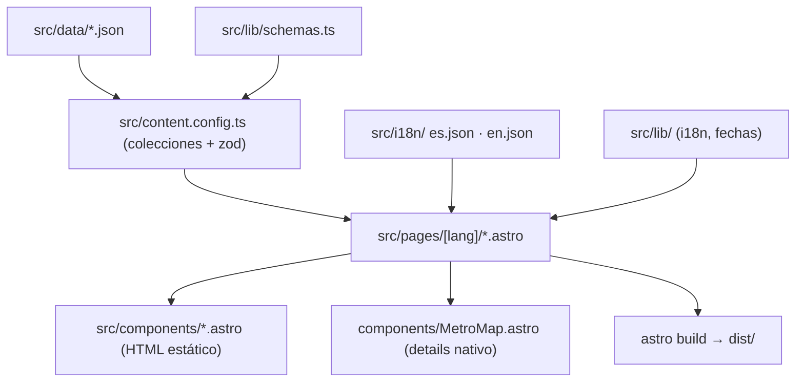

# Arquitectura

## 1. Contexto

Sitio estático público que presenta el perfil profesional de Juan Sebastián Martínez a reclutadores (mayoría no técnicos). Prioridades: lectura en segundos, celular, SEO y vista previa al compartir, dos idiomas.

## 2. Estructura del repositorio

```
frontend/   Astro 7 + Tailwind 4 — único paquete en v1
docs/       Esta documentación
.github/    CI
```

Si se agrega backend, irá en `backend/` con su propio `package.json`, como en los proyectos de la Gobernación ([ADR 0002](decisions/0002-sin-backend-v1.md)).

## 3. Capas del frontend



| Carpeta | Responsabilidad |
|---|---|
| `src/data/` | Contenido (perfil, experiencia, proyectos, habilidades, cursos). Único lugar que se edita para cambiar información. |
| `src/lib/` | Lógica pura sin dependencias del runtime de Astro (solo `astro/zod`): idiomas, fechas, esquemas zod. Probada con Vitest. |
| `src/content.config.ts` | Define colecciones con `file()` loader y agrega referencias entre colecciones. |
| `src/lib/metro.ts` | Trazado del metro: orden de estaciones, líneas presentes y tramos por fila. |
| `src/i18n/` | Textos de interfaz (botones, etiquetas). Mismas claves en ambos idiomas. |
| `src/layouts/` | `BaseLayout`: `<head>`, SEO, `hreflang`, script anti-parpadeo del tema. |
| `src/components/` | Componentes Astro sin JS de cliente, salvo scripts mínimos (tema). |
| `src/pages/` | `index.astro` (redirección por idioma), `404.astro`, `[lang]/…` generadas para `es` y `en`, incluida `[lang]/proyectos/[slug].astro` (una página por idioma y proyecto). |
| `src/styles/global.css` | Tailwind + tokens de color claro/oscuro. |
| `src/lib/home.ts` | Selección de datos de la principal: orden, proyectos destacados, empleo más reciente, iniciales. |
| `src/components/` (principal) | `ProfileCard`, `Section`, `ExperienceSummary`, `ProjectCard`, `SkillGroup`, `EducationList`, `ContactCTA`. Reciben `lang` y datos ya resueltos; sin JS de cliente. |
| `src/lib/projects.ts` | Detalle de proyecto: vecinos por `order` y etapas de experiencia relacionadas. |
| `src/lib/seo.ts` | Locale de Open Graph por idioma (`ogLocale`) y JSON-LD `schema.org/Person` (`personJsonLd`) para la principal. |

## 4. Idiomas

Rutas `/es/…` y `/en/…` ([ADR 0003](decisions/0003-i18n-rutas-es-en.md)). La raíz `/` redirige según `navigator.languages` usando `pickLocale()`.

La página 404 usa `noindex` y no emite canonical ni hreflang.

## 5. Contenido y validación

Todo texto visible es `{ es, en }`. Reglas que se validan (el build falla por esquema; las referencias rotas las detecta `tests/unit/content.test.ts`, que hace fallar la CI): traducción faltante, fecha mal formada o fin antes del inicio, proyecto anonimizado con `repo`/`demo`, referencia a un proyecto inexistente.

## 6. Tema

Variables CSS en `:root` (claro) y `[data-theme="dark"]` / `prefers-color-scheme: dark` (oscuro), expuestas a Tailwind con `@theme inline` (`bg-primary`, `text-text-muted`, …). La elección manual se guarda en `localStorage["theme"]`. El botón (`ThemeToggle.astro`) muestra ícono de sol o luna según el tema activo y expone `aria-pressed`.

## 7. SEO

`BaseLayout.astro` emite, para cada página: Open Graph (`og:type`, `og:title`, `og:description`, `og:image` de 1200×630, `og:locale` + `og:locale:alternate`), Twitter Card (`summary_large_image`) y `hreflang` `es`/`en` más `x-default` (apunta a `/es/`). La imagen OG es una por idioma (`/img/og-{lang}.png`), generada con Playwright desde `og/og.html` (`pnpm og`, ver `frontend/scripts/build-og.mjs`); se autogenera a partir de `src/data/profile.json`, así que hay que regenerarla si ese archivo cambia.

La principal (`[lang]/index.astro`) agrega JSON-LD `schema.org/Person` (`personJsonLd` en `src/lib/seo.ts`) y pasa `type="profile"` al layout; el detalle de proyecto pasa `type="article"`.

`src/pages/robots.txt.ts` es un endpoint estático (`APIRoute`) que apunta a `/sitemap-index.xml` usando `Astro.site`. El sitemap (`@astrojs/sitemap`) usa códigos de idioma `es`/`en` (no `es-CO`/`en-US`) para que coincidan con los `hreflang` que emite el layout.

## 8. Animaciones

Transiciones nativas **entre documentos** (`@view-transition { navigation: auto; }` en `global.css`), sin `ClientRouter` ni JS propio: el fundido (`::view-transition-old/new(root)`) corre en cada navegación y el navegador anima automáticamente cualquier elemento que comparta `view-transition-name` entre la página de salida y la de llegada.

Nombres compartidos:
- `project-title-<id>`: `<h3>` de la tarjeta en `ProjectCard.astro` ↔ `<h1>` de `[lang]/proyectos/[slug].astro`.
- `journey-title`: `<h2>` de la sección "Experiencia" en la principal (`Section` con prop `vtName`) ↔ `<h1>` de `[lang]/experiencia.astro`.

Los 8 detalles de hover (tarjetas que se elevan, flecha que avanza, subrayado que crece, etiquetas de tecnología, punto del metro, ícono de tema, anillo de foto, destello del CV) son utilidades CSS en `global.css`, dentro de `@media (hover: hover)` para no activarse en táctil. Con `prefers-reduced-motion: reduce` se desactivan tanto las transiciones de página (`navigation: none`) como las animaciones `::view-transition-*` y las transiciones de hover (regla existente que pone `transition-duration: 0.01ms !important`).

Última actualización: 2026-09-23
