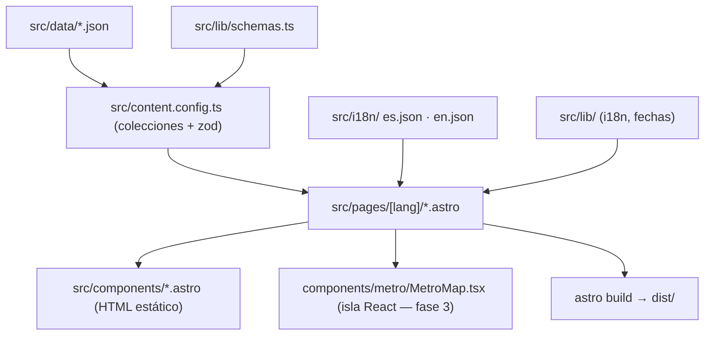

# Arquitectura

## 1. Contexto

Sitio estático público que presenta el perfil profesional de Juan Sebastián Martínez a reclutadores (mayoría no técnicos). Prioridades: lectura en segundos, celular, SEO y vista previa al compartir, dos idiomas.

## 2. Estructura del repositorio

```
frontend/   Astro 7 + React 19 (isla) + Tailwind 4 — único paquete en v1
docs/       Esta documentación
.github/    CI
```

Si se agrega backend, irá en `backend/` con su propio `package.json`, como en los proyectos de la Gobernación ([ADR 0002](decisions/0002-sin-backend-v1.md)).

## 3. Capas del frontend



| Carpeta | Responsabilidad |
|---|---|
| `src/data/` | Contenido (perfil, experiencia, proyectos, habilidades, cursos). Único lugar que se edita para cambiar información. |
| `src/lib/` | Lógica pura sin dependencias del runtime de Astro (solo `astro/zod`): idiomas, fechas, esquemas zod. Probada con Vitest. |
| `src/content.config.ts` | Define colecciones con `file()` loader y agrega referencias entre colecciones. |
| `src/i18n/` | Textos de interfaz (botones, etiquetas). Mismas claves en ambos idiomas. |
| `src/layouts/` | `BaseLayout`: `<head>`, SEO, `hreflang`, script anti-parpadeo del tema. |
| `src/components/` | Componentes Astro sin JS de cliente, salvo scripts mínimos (tema). |
| `src/pages/` | `index.astro` (redirección por idioma), `404.astro`, `[lang]/…` generadas para `es` y `en`. |
| `src/styles/global.css` | Tailwind + tokens de color claro/oscuro. |
| `src/lib/home.ts` | Selección de datos de la principal: orden, proyectos destacados, empleo más reciente, iniciales. |
| `src/components/` (principal) | `ProfileCard`, `Section`, `ExperienceSummary`, `ProjectCard`, `SkillGroup`, `EducationList`, `ContactCTA`. Reciben `lang` y datos ya resueltos; sin JS de cliente. |

## 4. Idiomas

Rutas `/es/…` y `/en/…` ([ADR 0003](decisions/0003-i18n-rutas-es-en.md)). La raíz `/` redirige según `navigator.languages` usando `pickLocale()`.

La página 404 usa `noindex` y no emite canonical ni hreflang.

## 5. Contenido y validación

Todo texto visible es `{ es, en }`. Reglas que se validan (el build falla por esquema; las referencias rotas las detecta `tests/unit/content.test.ts`, que hace fallar la CI): traducción faltante, fecha mal formada o fin antes del inicio, proyecto anonimizado con `repo`/`demo`, referencia a un proyecto inexistente.

## 6. Tema

Variables CSS en `:root` (claro) y `[data-theme="dark"]` / `prefers-color-scheme: dark` (oscuro), expuestas a Tailwind con `@theme inline` (`bg-primary`, `text-text-muted`, …). La elección manual se guarda en `localStorage["theme"]`.

Última actualización: 2026-09-22

