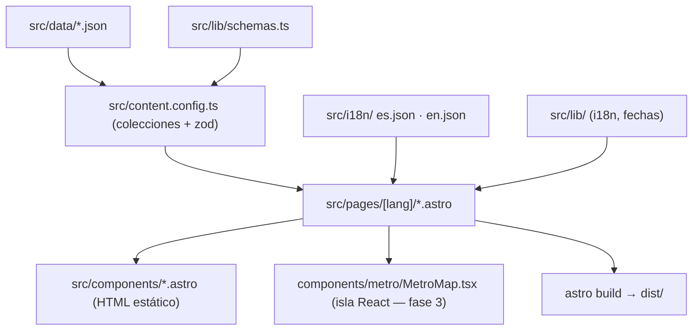

# Fase 1 — Base del portafolio Implementation Plan

> **For agentic workers:** REQUIRED SUB-SKILL: Use superpowers:subagent-driven-development (recommended) or superpowers:executing-plans to implement this plan task-by-task. Steps use checkbox (`- [ ]`) syntax for tracking.

**Goal:** Dejar el esqueleto del portafolio funcionando: Astro en `frontend/` con idiomas es/en, tema claro/oscuro con la paleta morado + lavanda, colecciones de contenido validadas con datos iniciales del CV, pruebas (Vitest + Playwright), CI y la documentación completa con estructura Gobernación.

**Architecture:** Sitio estático Astro 7. Lógica pura en `frontend/src/lib/` (i18n, fechas, esquemas zod) probada con Vitest. Contenido en JSON bajo `frontend/src/data/`, cargado por colecciones (`file()` loader) en `src/content.config.ts`. Páginas en `src/pages/[lang]/` con `getStaticPaths` para `es` y `en`. Tema con variables CSS mapeadas a Tailwind 4 vía `@theme inline`.

**Tech Stack:** Astro 7.3, @astrojs/react 7, @astrojs/sitemap 3.7, Tailwind 4.3 (`@tailwindcss/vite`), React 19, zod 4 (vía `astro/zod`), Vitest 5, Playwright 1.63, TypeScript 6 (`astro check` **no** soporta TS 7), pnpm 11, Node 22.

**Spec:** [2026-09-22-portafolio-v1-design.md](../specs/2026-09-22-portafolio-v1-design.md)

---

## Mapa de archivos

```
Portfolio/
├── README.md                                   (crear)
├── CLAUDE.md                                   (crear)
├── .github/workflows/ci.yml                    (crear)
├── docs/                                       (crear: index, log, 01..04)
└── frontend/
    ├── package.json                            (scaffold + scripts)
    ├── pnpm-workspace.yaml                     (scaffold: allowBuilds)
    ├── astro.config.mjs                        (i18n, integraciones)
    ├── tsconfig.json                           (scaffold)
    ├── vitest.config.ts                        (crear)
    ├── playwright.config.ts                    (crear)
    ├── README.md                               (reemplazar)
    ├── public/cv/                              (CV ES)
    ├── src/
    │   ├── lib/i18n.ts          locales, pickLocale, otherLocale, switchLocalePath
    │   ├── lib/dates.ts         formatMonth, formatRange, formatDuration
    │   ├── lib/schemas.ts       localized + esquemas de cada colección
    │   ├── i18n/es.json, en.json, index.ts (t)
    │   ├── content.config.ts    colecciones
    │   ├── data/*.json          contenido inicial (del CV)
    │   ├── styles/global.css    Tailwind + tokens de color
    │   ├── layouts/BaseLayout.astro
    │   ├── components/ThemeToggle.astro, LangSwitch.astro
    │   └── pages/index.astro, 404.astro, [lang]/index.astro
    ├── tests/unit/*.test.ts
    └── tests/e2e/*.spec.ts
```

Todos los comandos de `frontend/` se ejecutan con el directorio de trabajo en `Portfolio/frontend`.

---

### Task 1: Scaffold de Astro en `frontend/`

**Files:**
- Create: `frontend/` (scaffold), `frontend/vitest.config.ts`
- Modify: `frontend/package.json`, `frontend/astro.config.mjs`
- Delete: `frontend/AGENTS.md`, `frontend/CLAUDE.md` (los genera el scaffold; el contexto vive en el `CLAUDE.md` raíz)

- [ ] **Step 1: Crear el proyecto**

Desde `Portfolio/`:
```bash
pnpm create astro@latest frontend -- --template minimal --install --no-git --yes
```
Expected: `Project initialized!` y carpeta `frontend/` con `pnpm-workspace.yaml` (con `allowBuilds: esbuild, sharp`).

- [ ] **Step 2: Integraciones y dependencias de desarrollo**

Desde `frontend/`:
```bash
pnpm astro add react tailwind sitemap --yes
pnpm add -D vitest @astrojs/check typescript@^6 @playwright/test
rm AGENTS.md CLAUDE.md
```

- [ ] **Step 3: Configurar Astro**

Reemplazar `frontend/astro.config.mjs`:
```js
// @ts-check
import { defineConfig } from 'astro/config';
import react from '@astrojs/react';
import tailwindcss from '@tailwindcss/vite';
import sitemap from '@astrojs/sitemap';

// SITE_URL se define al elegir hosting (ver docs/03-operacion/deploy.md).
const site = process.env.SITE_URL ?? 'http://localhost:4321';

export default defineConfig({
  site,
  i18n: {
    locales: ['es', 'en'],
    defaultLocale: 'es',
    routing: { prefixDefaultLocale: true, redirectToDefaultLocale: false },
  },
  integrations: [
    react(),
    sitemap({ i18n: { defaultLocale: 'es', locales: { es: 'es-CO', en: 'en-US' } } }),
  ],
  vite: { plugins: [tailwindcss()] },
});
```

- [ ] **Step 4: Vitest**

Crear `frontend/vitest.config.ts`:
```ts
/// <reference types="vitest/config" />
import { getViteConfig } from 'astro/config';

export default getViteConfig({
  test: { include: ['tests/unit/**/*.test.ts'] },
});
```

- [ ] **Step 5: Scripts**

En `frontend/package.json` cambiar `"name"` a `"portfolio-frontend"` y dejar `scripts` así:
```json
"scripts": {
  "dev": "astro dev",
  "build": "astro build",
  "preview": "astro preview",
  "check": "astro check",
  "test": "vitest run",
  "test:e2e": "playwright test",
  "astro": "astro"
}
```

- [ ] **Step 6: Verificar build y check**

```bash
pnpm build && pnpm check
```
Expected: `Complete!` y `0 errors`.

- [ ] **Step 7: Commit**

```bash
git add frontend
git commit -m "chore: scaffold Astro frontend with React, Tailwind and sitemap"
```

---

### Task 2: Utilidades de idioma (`lib/i18n.ts`)

**Files:**
- Create: `frontend/src/lib/i18n.ts`
- Test: `frontend/tests/unit/i18n.test.ts`

- [ ] **Step 1: Test que falla**

`frontend/tests/unit/i18n.test.ts`:
```ts
import { describe, it, expect } from 'vitest';
import { LOCALES, isLocale, pickLocale, otherLocale, switchLocalePath } from '../../src/lib/i18n';

describe('isLocale', () => {
  it('acepta solo es y en', () => {
    expect(LOCALES).toEqual(['es', 'en']);
    expect(isLocale('es')).toBe(true);
    expect(isLocale('en')).toBe(true);
    expect(isLocale('fr')).toBe(false);
    expect(isLocale(undefined)).toBe(false);
  });
});

describe('pickLocale', () => {
  it('elige en para cualquier variante de inglés', () => {
    expect(pickLocale(['en-US', 'es'])).toBe('en');
    expect(pickLocale(['EN'])).toBe('en');
  });
  it('elige es para español', () => {
    expect(pickLocale(['es-CO'])).toBe('es');
  });
  it('usa el primer idioma soportado de la lista', () => {
    expect(pickLocale(['fr-FR', 'en-GB', 'es'])).toBe('en');
  });
  it('cae a es si no hay idioma soportado o la lista está vacía', () => {
    expect(pickLocale(['fr', 'de'])).toBe('es');
    expect(pickLocale([])).toBe('es');
  });
});

describe('otherLocale', () => {
  it('devuelve el idioma contrario', () => {
    expect(otherLocale('es')).toBe('en');
    expect(otherLocale('en')).toBe('es');
  });
});

describe('switchLocalePath', () => {
  it('cambia el prefijo conservando la ruta', () => {
    expect(switchLocalePath('/es/experiencia/', 'en')).toBe('/en/experiencia/');
    expect(switchLocalePath('/en/proyectos/ancla/', 'es')).toBe('/es/proyectos/ancla/');
  });
  it('maneja la raíz del idioma con y sin barra final', () => {
    expect(switchLocalePath('/es/', 'en')).toBe('/en/');
    expect(switchLocalePath('/es', 'en')).toBe('/en/');
  });
  it('rutas sin prefijo van a la raíz del idioma destino', () => {
    expect(switchLocalePath('/', 'en')).toBe('/en/');
    expect(switchLocalePath('/otra/', 'es')).toBe('/es/');
  });
});
```

- [ ] **Step 2: Verificar que falla**

Run: `pnpm test`
Expected: FAIL — `Failed to resolve import "../../src/lib/i18n"`.

- [ ] **Step 3: Implementación**

`frontend/src/lib/i18n.ts`:
```ts
export const LOCALES = ['es', 'en'] as const;
export type Locale = (typeof LOCALES)[number];
export const DEFAULT_LOCALE: Locale = 'es';

export function isLocale(value: string | undefined): value is Locale {
  return value !== undefined && (LOCALES as readonly string[]).includes(value);
}

/** Primer idioma soportado según la lista del navegador (navigator.languages). */
export function pickLocale(languages: readonly string[]): Locale {
  for (const lang of languages) {
    const base = lang.toLowerCase().split('-')[0];
    if (isLocale(base)) return base;
  }
  return DEFAULT_LOCALE;
}

export function otherLocale(locale: Locale): Locale {
  return locale === 'es' ? 'en' : 'es';
}

/** '/es/experiencia/' + 'en' → '/en/experiencia/'. Rutas sin prefijo → raíz del idioma. */
export function switchLocalePath(pathname: string, target: Locale): string {
  const segments = pathname.split('/').filter(Boolean);
  if (segments.length === 0 || !isLocale(segments[0])) return `/${target}/`;
  const rest = segments.slice(1);
  return rest.length === 0 ? `/${target}/` : `/${target}/${rest.join('/')}/`;
}
```

- [ ] **Step 4: Verificar que pasa**

Run: `pnpm test`
Expected: PASS (todos los tests de `i18n.test.ts`).

- [ ] **Step 5: Commit**

```bash
git add frontend/src/lib/i18n.ts frontend/tests/unit/i18n.test.ts
git commit -m "feat: add locale helpers"
```

---

### Task 3: Fechas y duraciones (`lib/dates.ts`)

Meses propios (no `Intl`) para que el resultado sea idéntico en cualquier Node/navegador.

**Files:**
- Create: `frontend/src/lib/dates.ts`
- Test: `frontend/tests/unit/dates.test.ts`

- [ ] **Step 1: Test que falla**

`frontend/tests/unit/dates.test.ts`:
```ts
import { describe, it, expect } from 'vitest';
import { formatMonth, formatRange, monthsBetween, formatDuration } from '../../src/lib/dates';

describe('formatMonth', () => {
  it('formatea YYYY-MM por idioma', () => {
    expect(formatMonth('2025-08', 'es')).toBe('ago 2025');
    expect(formatMonth('2025-08', 'en')).toBe('Aug 2025');
    expect(formatMonth('2026-01', 'es')).toBe('ene 2026');
  });
  it('rechaza formatos inválidos', () => {
    expect(() => formatMonth('2025-13', 'es')).toThrow();
    expect(() => formatMonth('2025', 'es')).toThrow();
  });
});

describe('formatRange', () => {
  it('une inicio y fin', () => {
    expect(formatRange('2025-08', '2026-08', 'es')).toBe('ago 2025 – ago 2026');
  });
  it('fin null = hoy / present', () => {
    expect(formatRange('2025-10', null, 'es')).toBe('oct 2025 – hoy');
    expect(formatRange('2025-10', null, 'en')).toBe('Oct 2025 – present');
  });
});

describe('monthsBetween', () => {
  it('cuenta meses inclusivos', () => {
    expect(monthsBetween('2025-03', '2025-07')).toBe(5);
    expect(monthsBetween('2025-08', '2026-08')).toBe(13);
    expect(monthsBetween('2025-08', '2025-08')).toBe(1);
  });
});

describe('formatDuration', () => {
  it('años y meses en español', () => {
    expect(formatDuration(13, 'es')).toBe('1 año 1 mes');
    expect(formatDuration(5, 'es')).toBe('5 meses');
    expect(formatDuration(24, 'es')).toBe('2 años');
    expect(formatDuration(26, 'es')).toBe('2 años 2 meses');
  });
  it('años y meses en inglés', () => {
    expect(formatDuration(13, 'en')).toBe('1 yr 1 mo');
    expect(formatDuration(5, 'en')).toBe('5 mos');
    expect(formatDuration(24, 'en')).toBe('2 yrs');
  });
});
```

- [ ] **Step 2: Verificar que falla**

Run: `pnpm test`
Expected: FAIL — `Failed to resolve import "../../src/lib/dates"`.

- [ ] **Step 3: Implementación**

`frontend/src/lib/dates.ts`:
```ts
import type { Locale } from './i18n';

const MONTHS: Record<Locale, readonly string[]> = {
  es: ['ene', 'feb', 'mar', 'abr', 'may', 'jun', 'jul', 'ago', 'sep', 'oct', 'nov', 'dic'],
  en: ['Jan', 'Feb', 'Mar', 'Apr', 'May', 'Jun', 'Jul', 'Aug', 'Sep', 'Oct', 'Nov', 'Dec'],
};

const PRESENT: Record<Locale, string> = { es: 'hoy', en: 'present' };

export const YEAR_MONTH = /^\d{4}-(0[1-9]|1[0-2])$/;

function parse(ym: string): { year: number; month: number } {
  if (!YEAR_MONTH.test(ym)) throw new Error(`Fecha inválida (se espera YYYY-MM): ${ym}`);
  const [year, month] = ym.split('-').map(Number);
  return { year, month };
}

export function formatMonth(ym: string, locale: Locale): string {
  const { year, month } = parse(ym);
  return `${MONTHS[locale][month - 1]} ${year}`;
}

export function formatRange(start: string, end: string | null, locale: Locale): string {
  const to = end === null ? PRESENT[locale] : formatMonth(end, locale);
  return `${formatMonth(start, locale)} – ${to}`;
}

/** Meses inclusivos: mar–jul = 5. */
export function monthsBetween(start: string, end: string): number {
  const a = parse(start);
  const b = parse(end);
  return (b.year - a.year) * 12 + (b.month - a.month) + 1;
}

const UNITS: Record<Locale, { y: [string, string]; m: [string, string] }> = {
  es: { y: ['año', 'años'], m: ['mes', 'meses'] },
  en: { y: ['yr', 'yrs'], m: ['mo', 'mos'] },
};

export function formatDuration(totalMonths: number, locale: Locale): string {
  const years = Math.floor(totalMonths / 12);
  const months = totalMonths % 12;
  const u = UNITS[locale];
  const parts: string[] = [];
  if (years > 0) parts.push(`${years} ${years === 1 ? u.y[0] : u.y[1]}`);
  if (months > 0) parts.push(`${months} ${months === 1 ? u.m[0] : u.m[1]}`);
  return parts.join(' ');
}
```

- [ ] **Step 4: Verificar que pasa**

Run: `pnpm test`
Expected: PASS.

- [ ] **Step 5: Commit**

```bash
git add frontend/src/lib/dates.ts frontend/tests/unit/dates.test.ts
git commit -m "feat: add bilingual date and duration formatting"
```

---

### Task 4: Esquemas de contenido (`lib/schemas.ts`)

Esquemas puros (sin `astro:content`) para probarlos con Vitest. La referencia entre colecciones se agrega en `content.config.ts` (Task 5).

**Files:**
- Create: `frontend/src/lib/schemas.ts`
- Test: `frontend/tests/unit/schemas.test.ts`

- [ ] **Step 1: Test que falla**

`frontend/tests/unit/schemas.test.ts`:
```ts
import { describe, it, expect } from 'vitest';
import {
  localized, profileSchema, experienceSchema, projectSchema, skillSchema, courseSchema,
} from '../../src/lib/schemas';

const L = (s: string) => ({ es: s, en: s });

const baseProject = {
  title: L('Ancla'), tagline: L('t'), problem: L('p'), role: L('r'), solution: L('s'), result: L('x'),
  tech: ['Java'], visibility: 'full' as const, featured: true, order: 1, images: [],
};

describe('localized', () => {
  it('exige ambos idiomas no vacíos', () => {
    expect(localized.safeParse({ es: 'Hola', en: 'Hi' }).success).toBe(true);
    expect(localized.safeParse({ es: 'Hola' }).success).toBe(false);
    expect(localized.safeParse({ es: 'Hola', en: '' }).success).toBe(false);
  });
});

describe('projectSchema', () => {
  it('acepta proyecto completo con repo', () => {
    expect(projectSchema.safeParse({ ...baseProject, repo: 'https://github.com/THEJUANX94/Ancla' }).success).toBe(true);
  });
  it('rechaza proyecto anonimizado con repo o demo', () => {
    expect(projectSchema.safeParse({ ...baseProject, visibility: 'anonymized', repo: 'https://github.com/x/y' }).success).toBe(false);
    expect(projectSchema.safeParse({ ...baseProject, visibility: 'anonymized', demo: 'https://x.co' }).success).toBe(false);
  });
  it('acepta proyecto anonimizado sin enlaces', () => {
    expect(projectSchema.safeParse({ ...baseProject, visibility: 'anonymized' }).success).toBe(true);
  });
  it('exige alt bilingüe en imágenes', () => {
    expect(projectSchema.safeParse({ ...baseProject, images: [{ src: '/img/a.png', alt: { es: 'a' } }] }).success).toBe(false);
  });
});

describe('experienceSchema', () => {
  const exp = { line: 'work', organization: L('Gob'), role: L('Dev'), start: '2025-08', end: null, highlights: [L('h')], tech: [], projects: [] };
  it('acepta fin null (hoy)', () => {
    expect(experienceSchema.safeParse(exp).success).toBe(true);
  });
  it('rechaza línea desconocida y fechas mal formadas', () => {
    expect(experienceSchema.safeParse({ ...exp, line: 'freelance' }).success).toBe(false);
    expect(experienceSchema.safeParse({ ...exp, start: '2025-8' }).success).toBe(false);
  });
  it('rechaza fin anterior al inicio', () => {
    expect(experienceSchema.safeParse({ ...exp, start: '2026-01', end: '2025-12' }).success).toBe(false);
  });
});

describe('profileSchema, skillSchema, courseSchema', () => {
  it('validan entradas mínimas', () => {
    expect(profileSchema.safeParse({
      name: 'Juan', title: L('t'), summary: L('s'), location: L('l'), available: true, availabilityNote: L('n'),
      email: 'a@b.co', linkedin: 'https://linkedin.com/in/x', github: 'https://github.com/x',
      cv: { es: '/cv/a.pdf', en: '/cv/b.pdf' }, languages: [{ name: L('Español'), level: L('Nativo') }],
    }).success).toBe(true);
    expect(skillSchema.safeParse({ group: L('g'), tech: ['Docker'], order: 1 }).success).toBe(true);
    expect(courseSchema.safeParse({ name: L('Java'), institution: 'Boomlabs', hours: 200, order: 1 }).success).toBe(true);
  });
  it('rechaza email inválido', () => {
    expect(profileSchema.safeParse({ email: 'no-es-email' }).success).toBe(false);
  });
});
```

- [ ] **Step 2: Verificar que falla**

Run: `pnpm test`
Expected: FAIL — `Failed to resolve import "../../src/lib/schemas"`.

- [ ] **Step 3: Implementación**

`frontend/src/lib/schemas.ts`:
```ts
import { z } from 'astro/zod';
import { YEAR_MONTH } from './dates';

export const localized = z.object({ es: z.string().min(1), en: z.string().min(1) });
export type Localized = z.infer<typeof localized>;

const yearMonth = z.string().regex(YEAR_MONTH, 'Formato esperado YYYY-MM');

export const profileSchema = z.object({
  name: z.string().min(1),
  title: localized,
  summary: localized,
  location: localized,
  available: z.boolean(),
  availabilityNote: localized,
  email: z.email(),
  linkedin: z.url(),
  github: z.url(),
  cv: z.object({ es: z.string().startsWith('/'), en: z.string().startsWith('/') }),
  languages: z.array(z.object({ name: localized, level: localized })),
  photo: z.string().startsWith('/').optional(),
});

export const LINES = ['work', 'projects', 'education'] as const;

/** Sin refinamientos para poder extenderlo en content.config.ts. */
export const experienceBase = z.object({
  line: z.enum(LINES),
  organization: localized,
  role: localized,
  start: yearMonth,
  end: yearMonth.nullable(),
  location: localized.optional(),
  highlights: z.array(localized),
  tech: z.array(z.string()),
  projects: z.array(z.string()),
});

const endAfterStart = (e: { start: string; end: string | null }) => e.end === null || e.end >= e.start;
const endAfterStartMsg = { message: 'La fecha de fin es anterior al inicio', path: ['end'] };

export const experienceSchema = experienceBase.refine(endAfterStart, endAfterStartMsg);

export const projectSchema = z
  .object({
    title: localized,
    tagline: localized,
    problem: localized,
    role: localized,
    solution: localized,
    result: localized,
    metrics: z.array(localized).optional(),
    images: z.array(z.object({ src: z.string().startsWith('/'), alt: localized })),
    tech: z.array(z.string()),
    visibility: z.enum(['full', 'anonymized']),
    repo: z.url().optional(),
    demo: z.url().optional(),
    featured: z.boolean(),
    order: z.number().int(),
  })
  .refine((p) => p.visibility === 'full' || (!p.repo && !p.demo), {
    message: 'Un proyecto anonimizado no puede tener repo ni demo',
    path: ['visibility'],
  });

export const skillSchema = z.object({
  group: localized,
  tech: z.array(z.string()).min(1),
  order: z.number().int(),
});

export const courseSchema = z.object({
  name: localized,
  institution: z.string().min(1),
  hours: z.number().int().positive().optional(),
  year: z.number().int().optional(),
  certificateUrl: z.url().optional(),
  order: z.number().int(),
});

export { endAfterStart, endAfterStartMsg };
```

- [ ] **Step 4: Verificar que pasa**

Run: `pnpm test`
Expected: PASS.

- [ ] **Step 5: Commit**

```bash
git add frontend/src/lib/schemas.ts frontend/tests/unit/schemas.test.ts
git commit -m "feat: add content schemas with bilingual and visibility rules"
```

---

### Task 5: Colecciones y contenido inicial

Contenido tomado de la hoja de vida. **No se inventan datos:** lo que el CV no dice (fechas de inicio de la universidad, fechas de AzureDistribuidos/Ancla, año de los cursos) se deja fuera hasta la fase 6. La hackatón se describe como *participación y liderazgo del reto*, sin afirmar premio, hasta que el usuario lo confirme.

**Files:**
- Create: `frontend/src/content.config.ts`, `frontend/src/data/{profile,experience,projects,skills,courses}.json`, `frontend/public/cv/CV-Juan-Sebastian-Martinez-ES.pdf`

- [ ] **Step 1: Colecciones**

`frontend/src/content.config.ts`:
```ts
import { defineCollection, reference } from 'astro:content';
import { file } from 'astro/loaders';
import { z } from 'astro/zod';
import {
  profileSchema, experienceBase, endAfterStart, endAfterStartMsg,
  projectSchema, skillSchema, courseSchema,
} from './lib/schemas';

const profile = defineCollection({ loader: file('src/data/profile.json'), schema: profileSchema });

const experience = defineCollection({
  loader: file('src/data/experience.json'),
  // Referencias reales: el build falla si un slug de proyecto no existe.
  schema: experienceBase
    .extend({ projects: z.array(reference('projects')) })
    .refine(endAfterStart, endAfterStartMsg),
});

const projects = defineCollection({ loader: file('src/data/projects.json'), schema: projectSchema });
const skills = defineCollection({ loader: file('src/data/skills.json'), schema: skillSchema });
const courses = defineCollection({ loader: file('src/data/courses.json'), schema: courseSchema });

export const collections = { profile, experience, projects, skills, courses };
```

- [ ] **Step 2: Perfil**

`frontend/src/data/profile.json`:
```json
[
  {
    "id": "main",
    "name": "Juan Sebastián Martínez Noreña",
    "title": {
      "es": "Ingeniero de Software · Full-Stack, DevOps e Infraestructura",
      "en": "Software Engineer · Full-Stack, DevOps & Infrastructure"
    },
    "summary": {
      "es": "Construyo aplicaciones web y me aseguro de que funcionen bien en producción. Lideré técnicamente siete aplicaciones de la Gobernación de Boyacá que usan cientos de funcionarios, desde el código hasta los servidores.",
      "en": "I build web applications and make sure they run reliably in production. I was the technical lead for seven applications at the Government of Boyacá used by hundreds of public servants, from code to servers."
    },
    "location": { "es": "Boyacá, Colombia", "en": "Boyacá, Colombia" },
    "available": true,
    "availabilityNote": {
      "es": "Disponible de inmediato · remoto, híbrido o presencial",
      "en": "Available now · remote, hybrid or on-site"
    },
    "email": "sebastianmn03@gmail.com",
    "linkedin": "https://www.linkedin.com/in/juan-sebastian-martinez-nore%C3%B1a",
    "github": "https://github.com/THEJUANX94",
    "cv": {
      "es": "/cv/CV-Juan-Sebastian-Martinez-ES.pdf",
      "en": "/cv/CV-Juan-Sebastian-Martinez-ES.pdf"
    },
    "languages": [
      { "name": { "es": "Español", "en": "Spanish" }, "level": { "es": "Nativo", "en": "Native" } },
      { "name": { "es": "Inglés", "en": "English" }, "level": { "es": "Intermedio-alto (B2)", "en": "Upper-intermediate (B2)" } }
    ]
  }
]
```
`cv.en` apunta al PDF en español hasta que exista la versión en inglés (fase 6); queda registrado en `docs/log.md`.

- [ ] **Step 3: Proyectos**

`frontend/src/data/projects.json`:
```json
[
  {
    "id": "consolidacion-infraestructura",
    "title": { "es": "Consolidación de infraestructura", "en": "Infrastructure consolidation" },
    "tagline": {
      "es": "De 7 a 3 servidores virtuales sin perder servicio",
      "en": "From 7 to 3 virtual servers without losing service"
    },
    "problem": {
      "es": "Siete aplicaciones institucionales repartidas en siete máquinas virtuales, cada una configurada distinto y con fallas que se detectaban cuando un usuario se quejaba.",
      "en": "Seven institutional applications spread across seven virtual machines, each configured differently, with failures detected only when a user complained."
    },
    "role": { "es": "Líder técnico: diseño, plan de migración y ejecución.", "en": "Technical lead: design, migration plan and execution." },
    "solution": {
      "es": "Unifiqué las aplicaciones en un esquema común con Docker, Docker Compose y Nginx, documentado en un ADR, y agregué monitoreo con alertas automáticas (Zabbix y Uptime Kuma).",
      "en": "I unified the applications on a common Docker, Docker Compose and Nginx setup, documented in an ADR, and added monitoring with automatic alerts (Zabbix and Uptime Kuma)."
    },
    "result": {
      "es": "57% menos infraestructura y visibilidad centralizada del estado de todos los servicios.",
      "en": "57% less infrastructure and centralized visibility of every service's health."
    },
    "metrics": [
      { "es": "−57% máquinas virtuales (7 → 3)", "en": "−57% virtual machines (7 → 3)" }
    ],
    "images": [],
    "tech": ["Docker", "Docker Compose", "Nginx", "Zabbix", "Uptime Kuma", "AlmaLinux", "Nutanix AHV"],
    "visibility": "anonymized",
    "featured": true,
    "order": 1
  },
  {
    "id": "postulaciones-docentes",
    "title": { "es": "Plataforma de postulaciones docentes", "en": "Teacher application platform" },
    "tagline": {
      "es": "Postulaciones y traslados docentes de la Secretaría de Educación en línea",
      "en": "Online teacher applications and transfers for the Department of Education"
    },
    "problem": {
      "es": "Los procesos de postulación y traslado de docentes del departamento requerían gestión manual de documentos y solicitudes.",
      "en": "Teacher application and transfer processes in the department relied on manual handling of documents and requests."
    },
    "role": { "es": "Desarrollo full-stack y despliegue.", "en": "Full-stack development and deployment." },
    "solution": {
      "es": "Aplicación web donde los docentes se postulan en línea y el equipo de la Secretaría revisa y gestiona las solicitudes.",
      "en": "A web application where teachers apply online and the Department's team reviews and manages requests."
    },
    "result": {
      "es": "Proceso centralizado y digital para docentes de todo el departamento.",
      "en": "A centralized, digital process for teachers across the department."
    },
    "images": [],
    "tech": ["Node.js", "PostgreSQL", "Docker"],
    "visibility": "anonymized",
    "featured": true,
    "order": 2
  },
  {
    "id": "cardenas-vision",
    "title": { "es": "Reto Cárdenas Visión — Hackathon Boyacá Innovate 2025", "en": "Cárdenas Visión challenge — Hackathon Boyacá Innovate 2025" },
    "tagline": {
      "es": "Solución creada en una hackatón que la empresa siguió desarrollando con nosotros",
      "en": "A hackathon solution the company kept developing with us"
    },
    "problem": {
      "es": "Reto empresarial de Cárdenas Visión planteado en la primera Hackathon Boyacá Innovate (28–30 de octubre de 2025).",
      "en": "Business challenge from Cárdenas Visión at the first Hackathon Boyacá Innovate (October 28–30, 2025)."
    },
    "role": { "es": "Líder del equipo.", "en": "Team lead." },
    "solution": {
      "es": "Aplicación con gestión de citas y un canal de atención automatizado con IA.",
      "en": "An application with appointment management and an AI-powered automated service channel."
    },
    "result": {
      "es": "La solución se entregó a Cárdenas Visión y el desarrollo continúa en conjunto con la empresa.",
      "en": "The solution was handed over to Cárdenas Visión and development continues together with the company."
    },
    "images": [],
    "tech": ["Node.js", "React", "n8n", "Vapi"],
    "visibility": "anonymized",
    "featured": true,
    "order": 3
  },
  {
    "id": "azure-distribuidos",
    "title": { "es": "Aplicación distribuida de estudiantes", "en": "Distributed student application" },
    "tagline": {
      "es": "Gestión de estudiantes, materias, docentes y cupos en la nube",
      "en": "Cloud-based management of students, courses, teachers and seats"
    },
    "problem": {
      "es": "Proyecto universitario: gestionar estudiantes, materias inscritas, docentes y cupos por materia en un sistema distribuido.",
      "en": "University project: manage students, enrolled courses, teachers and seats per course in a distributed system."
    },
    "role": { "es": "Desarrollo full-stack.", "en": "Full-stack development." },
    "solution": {
      "es": "Sistema web con Angular y TypeScript desplegado en Azure, con PostgreSQL.",
      "en": "Web system built with Angular and TypeScript, deployed on Azure, with PostgreSQL."
    },
    "result": {
      "es": "Aplicación funcional con código abierto en GitHub.",
      "en": "Working application with open-source code on GitHub."
    },
    "images": [],
    "tech": ["TypeScript", "Angular", "Azure", "PostgreSQL"],
    "visibility": "full",
    "repo": "https://github.com/THEJUANX94/AzureDistribuidos",
    "featured": true,
    "order": 4
  },
  {
    "id": "ancla",
    "title": { "es": "Ancla — inventario y facturación", "en": "Ancla — inventory and invoicing" },
    "tagline": {
      "es": "Inventario y facturación para una empresa de maquillaje",
      "en": "Inventory and invoicing for a cosmetics business"
    },
    "problem": {
      "es": "Una empresa de maquillaje necesitaba controlar su inventario y facturar sin hojas de cálculo.",
      "en": "A cosmetics business needed to track inventory and issue invoices without spreadsheets."
    },
    "role": { "es": "Desarrollo completo.", "en": "End-to-end development." },
    "solution": {
      "es": "Aplicación de escritorio en Java con base de datos SQLite.",
      "en": "Desktop application in Java with an SQLite database."
    },
    "result": {
      "es": "Inventario y facturación en una sola herramienta.",
      "en": "Inventory and invoicing in a single tool."
    },
    "images": [],
    "tech": ["Java", "SQLite"],
    "visibility": "full",
    "repo": "https://github.com/THEJUANX94/Ancla",
    "featured": false,
    "order": 5
  }
]
```

- [ ] **Step 4: Experiencia**

`frontend/src/data/experience.json`:
```json
[
  {
    "id": "tech-lead-gobernacion",
    "line": "work",
    "organization": { "es": "Gobernación de Boyacá — Dirección de Sistemas", "en": "Government of Boyacá — IT Department" },
    "role": { "es": "Ingeniero de Software e Infraestructura (Tech Lead)", "en": "Software & Infrastructure Engineer (Tech Lead)" },
    "start": "2025-08",
    "end": "2026-08",
    "highlights": [
      { "es": "Reduje 57% la infraestructura (de 7 a 3 servidores virtuales) unificando las aplicaciones con Docker y Nginx.", "en": "Cut infrastructure by 57% (7 to 3 virtual servers) by unifying the applications on Docker and Nginx." },
      { "es": "Lideré 7 aplicaciones en producción usadas por cientos de funcionarios.", "en": "Led 7 production applications used by hundreds of public servants." },
      { "es": "Puse monitoreo y alertas automáticas en toda la infraestructura (Zabbix, Uptime Kuma).", "en": "Set up monitoring and automatic alerts across the infrastructure (Zabbix, Uptime Kuma)." },
      { "es": "Automaticé los despliegues con GitHub Actions, eliminando pasos manuales.", "en": "Automated deployments with GitHub Actions, removing manual steps." },
      { "es": "Estandaricé la documentación de los 7 repositorios y coordiné a los equipos de practicantes.", "en": "Standardized documentation across all 7 repositories and coordinated intern teams." }
    ],
    "tech": ["Next.js", "NestJS", "Angular", "Node.js", "Prisma", "PostgreSQL", "Docker", "Nginx", "Keycloak", "GitHub Actions"],
    "projects": ["consolidacion-infraestructura", "postulaciones-docentes"]
  },
  {
    "id": "practicante-gobernacion",
    "line": "work",
    "organization": { "es": "Gobernación de Boyacá — Dirección de Sistemas", "en": "Government of Boyacá — IT Department" },
    "role": { "es": "Practicante de Desarrollo de Software", "en": "Software Development Intern" },
    "start": "2025-03",
    "end": "2025-07",
    "highlights": [
      { "es": "Desarrollé y mantuve aplicaciones de la Dirección de Sistemas.", "en": "Built and maintained the IT Department's applications." },
      { "es": "Al terminar la práctica fui vinculado como responsable técnico del área.", "en": "After the internship I was hired as the area's technical lead." }
    ],
    "tech": ["JavaScript", "Google Cloud", "Power Apps"],
    "projects": []
  },
  {
    "id": "hackathon-cardenas-vision",
    "line": "projects",
    "organization": { "es": "Hackathon Boyacá Innovate 2025 · Cárdenas Visión", "en": "Hackathon Boyacá Innovate 2025 · Cárdenas Visión" },
    "role": { "es": "Líder de equipo", "en": "Team lead" },
    "start": "2025-10",
    "end": null,
    "highlights": [
      { "es": "Lideré al equipo que resolvió el reto empresarial de Cárdenas Visión.", "en": "Led the team that tackled Cárdenas Visión's business challenge." },
      { "es": "La solución se entregó a la empresa y seguimos desarrollándola en conjunto.", "en": "The solution was handed over to the company and we keep developing it together." }
    ],
    "tech": ["Node.js", "React", "n8n", "Vapi"],
    "projects": ["cardenas-vision"]
  }
]
```

- [ ] **Step 5: Habilidades y cursos**

`frontend/src/data/skills.json`:
```json
[
  { "id": "apps", "group": { "es": "Construyo aplicaciones", "en": "I build applications" }, "tech": ["TypeScript", "JavaScript", "Java", "Python", "Next.js", "NestJS", "Angular", "React", "Node.js", "Prisma"], "order": 1 },
  { "id": "produccion", "group": { "es": "Las pongo en producción", "en": "I ship them to production" }, "tech": ["Docker", "Docker Compose", "Nginx", "GitHub Actions", "Git"], "order": 2 },
  { "id": "servidores", "group": { "es": "Mantengo servidores estables y seguros", "en": "I keep servers stable and secure" }, "tech": ["Nutanix AHV", "AlmaLinux", "Windows Server", "Zabbix", "Uptime Kuma", "Keycloak", "fail2ban"], "order": 3 },
  { "id": "datos", "group": { "es": "Gestiono datos", "en": "I manage data" }, "tech": ["PostgreSQL", "Oracle SQL", "MySQL", "SQLite", "MongoDB"], "order": 4 },
  { "id": "equipos", "group": { "es": "Documento y lidero equipos", "en": "I document and lead teams" }, "tech": ["docs-as-code", "ADRs", "Twelve-Factor", "Liderazgo técnico"], "order": 5 },
  { "id": "nube", "group": { "es": "Nube", "en": "Cloud" }, "tech": ["Microsoft Azure", "Google Cloud"], "order": 6 }
]
```

`frontend/src/data/courses.json`:
```json
[
  { "id": "hackathon-2025", "name": { "es": "Hackathon Boyacá Innovate 2025 — Reto Empresarial Cárdenas Visión", "en": "Hackathon Boyacá Innovate 2025 — Cárdenas Visión Business Challenge" }, "institution": "Boyacá Innovate", "hours": 30, "year": 2025, "order": 1 },
  { "id": "java-boomlabs", "name": { "es": "Programación en Java", "en": "Java Programming" }, "institution": "Boomlabs Computer Science", "hours": 200, "order": 2 },
  { "id": "java-politecnico", "name": { "es": "Diplomado de Java", "en": "Java Diploma Course" }, "institution": "Politécnico de Colombia", "hours": 120, "order": 3 },
  { "id": "gcp-foundations", "name": { "es": "Google Cloud (4 cursos)", "en": "Google Cloud (4 courses)" }, "institution": "GCP Foundations Academy", "hours": 40, "order": 4 }
]
```

- [ ] **Step 6: CV**

```bash
mkdir -p public/cv
cp "/c/Users/sebas/Downloads/Hoja_de_vida_Juan_Sebastian_Martinez_ATS.pdf" public/cv/CV-Juan-Sebastian-Martinez-ES.pdf
```

- [ ] **Step 7: Verificar que el contenido valida**

Run: `pnpm build`
Expected: `Complete!` sin `InvalidContentEntryDataError`.

Prueba negativa (no se commitea): cambiar temporalmente en `experience.json` `"consolidacion-infraestructura"` por `"no-existe"` → `pnpm build` debe fallar mencionando `no-existe`. Revertir.

- [ ] **Step 8: Commit**

```bash
git add frontend/src/content.config.ts frontend/src/data frontend/public/cv
git commit -m "feat: add content collections with initial CV data"
```

---

### Task 6: Textos de interfaz (`src/i18n/`)

**Files:**
- Create: `frontend/src/i18n/es.json`, `frontend/src/i18n/en.json`, `frontend/src/i18n/index.ts`
- Test: `frontend/tests/unit/ui-strings.test.ts`

- [ ] **Step 1: Test que falla**

`frontend/tests/unit/ui-strings.test.ts`:
```ts
import { describe, it, expect } from 'vitest';
import es from '../../src/i18n/es.json';
import en from '../../src/i18n/en.json';
import { t } from '../../src/i18n';

describe('textos de interfaz', () => {
  it('es y en tienen exactamente las mismas claves', () => {
    expect(Object.keys(en).sort()).toEqual(Object.keys(es).sort());
  });
  it('ningún texto está vacío', () => {
    for (const v of [...Object.values(es), ...Object.values(en)]) expect(v.trim()).not.toBe('');
  });
  it('t devuelve el texto del idioma', () => {
    expect(t('es', 'theme.toggle')).toBe(es['theme.toggle']);
    expect(t('en', 'theme.toggle')).toBe(en['theme.toggle']);
  });
});
```

- [ ] **Step 2: Verificar que falla**

Run: `pnpm test`
Expected: FAIL — no se resuelve `../../src/i18n/es.json`.

- [ ] **Step 3: Implementación**

`frontend/src/i18n/es.json`:
```json
{
  "site.title": "Juan Sebastián Martínez — Ingeniero de Software",
  "site.description": "Portafolio de Juan Sebastián Martínez: desarrollo full-stack, DevOps e infraestructura.",
  "lang.switch": "English",
  "lang.switchLabel": "Ver en inglés",
  "theme.toggle": "Cambiar tema claro u oscuro",
  "nav.skip": "Saltar al contenido",
  "notFound.title": "Página no encontrada",
  "notFound.back": "Volver al inicio"
}
```

`frontend/src/i18n/en.json`:
```json
{
  "site.title": "Juan Sebastián Martínez — Software Engineer",
  "site.description": "Portfolio of Juan Sebastián Martínez: full-stack development, DevOps and infrastructure.",
  "lang.switch": "Español",
  "lang.switchLabel": "View in Spanish",
  "theme.toggle": "Toggle light or dark theme",
  "nav.skip": "Skip to content",
  "notFound.title": "Page not found",
  "notFound.back": "Back to home"
}
```

`frontend/src/i18n/index.ts`:
```ts
import es from './es.json';
import en from './en.json';
import type { Locale } from '../lib/i18n';

export type UiKey = keyof typeof es;
const STRINGS: Record<Locale, Record<UiKey, string>> = { es, en };

export function t(locale: Locale, key: UiKey): string {
  return STRINGS[locale][key];
}
```

- [ ] **Step 4: Verificar que pasa**

Run: `pnpm test`
Expected: PASS. `pnpm check` → `0 errors` (si `en.json` no tiene una clave de `es.json`, falla el tipo de `STRINGS`).

- [ ] **Step 5: Commit**

```bash
git add frontend/src/i18n frontend/tests/unit/ui-strings.test.ts
git commit -m "feat: add bilingual UI strings"
```

---

### Task 7: Tokens de color, layout base, tema e idioma

**Files:**
- Modify: `frontend/src/styles/global.css`
- Create: `frontend/src/layouts/BaseLayout.astro`, `frontend/src/components/ThemeToggle.astro`, `frontend/src/components/LangSwitch.astro`
- Replace: `frontend/src/pages/index.astro`
- Create: `frontend/src/pages/[lang]/index.astro`, `frontend/src/pages/404.astro`

- [ ] **Step 1: Tokens y Tailwind**

`frontend/src/styles/global.css`:
```css
@import "tailwindcss";

/* Paleta morado + lavanda (spec: Tema y estilo). */
:root {
  --bg: #f7f5fc;
  --surface: #ffffff;
  --surface-soft: #ede9fe;
  --primary: #4c1d95;
  --on-primary: #ffffff;
  --accent: #a78bfa;
  --text: #1e1433;
  --text-muted: #6b6480;
  --border: #e4dff0;
  color-scheme: light;
}

@media (prefers-color-scheme: dark) {
  :root:not([data-theme="light"]) {
    --bg: #150d24;
    --surface: #231638;
    --surface-soft: #2e1d4a;
    --primary: #a78bfa;
    --on-primary: #150d24;
    --accent: #c4b5fd;
    --text: #ede9fe;
    --text-muted: #a79cc4;
    --border: #3a2a57;
    color-scheme: dark;
  }
}

:root[data-theme="dark"] {
  --bg: #150d24;
  --surface: #231638;
  --surface-soft: #2e1d4a;
  --primary: #a78bfa;
  --on-primary: #150d24;
  --accent: #c4b5fd;
  --text: #ede9fe;
  --text-muted: #a79cc4;
  --border: #3a2a57;
  color-scheme: dark;
}

@theme inline {
  --color-bg: var(--bg);
  --color-surface: var(--surface);
  --color-surface-soft: var(--surface-soft);
  --color-primary: var(--primary);
  --color-on-primary: var(--on-primary);
  --color-accent: var(--accent);
  --color-text: var(--text);
  --color-text-muted: var(--text-muted);
  --color-border: var(--border);
  --font-sans: "Plus Jakarta Sans", ui-sans-serif, system-ui, sans-serif;
}

body {
  background: var(--bg);
  color: var(--text);
}

@media (prefers-reduced-motion: reduce) {
  *, *::before, *::after {
    animation-duration: 0.01ms !important;
    transition-duration: 0.01ms !important;
    scroll-behavior: auto !important;
  }
}
```

- [ ] **Step 2: Botón de tema**

`frontend/src/components/ThemeToggle.astro`:
```astro
---
import type { Locale } from '../lib/i18n';
import { t } from '../i18n';
interface Props { lang: Locale }
const { lang } = Astro.props;
---
<button
  type="button"
  data-theme-toggle
  aria-label={t(lang, 'theme.toggle')}
  title={t(lang, 'theme.toggle')}
  class="rounded-full border border-border bg-surface p-2 text-text hover:bg-surface-soft focus-visible:outline-2 focus-visible:outline-primary"
>
  <span aria-hidden="true" class="block dark-icon">☾</span>
</button>
<script>
  const KEY = 'theme';
  function current(): 'light' | 'dark' {
    const set = document.documentElement.dataset.theme;
    if (set === 'light' || set === 'dark') return set;
    return matchMedia('(prefers-color-scheme: dark)').matches ? 'dark' : 'light';
  }
  for (const btn of document.querySelectorAll<HTMLButtonElement>('[data-theme-toggle]')) {
    btn.addEventListener('click', () => {
      const next = current() === 'dark' ? 'light' : 'dark';
      document.documentElement.dataset.theme = next;
      try { localStorage.setItem(KEY, next); } catch { /* almacenamiento no disponible */ }
    });
  }
</script>
```

- [ ] **Step 3: Selector de idioma**

`frontend/src/components/LangSwitch.astro`:
```astro
---
import { otherLocale, switchLocalePath, type Locale } from '../lib/i18n';
import { t } from '../i18n';
interface Props { lang: Locale }
const { lang } = Astro.props;
const target = otherLocale(lang);
const href = switchLocalePath(Astro.url.pathname, target);
---
<a
  href={href}
  hreflang={target}
  lang={target}
  data-lang-switch
  aria-label={t(lang, 'lang.switchLabel')}
  class="rounded-full border border-border bg-surface px-3 py-1.5 text-sm font-medium text-primary hover:bg-surface-soft focus-visible:outline-2 focus-visible:outline-primary"
>
  {t(lang, 'lang.switch')}
</a>
```

- [ ] **Step 4: Layout base**

`frontend/src/layouts/BaseLayout.astro`:
```astro
---
import '../styles/global.css';
import { LOCALES, switchLocalePath, type Locale } from '../lib/i18n';
import { t } from '../i18n';

interface Props {
  lang: Locale;
  title?: string;
  description?: string;
}
const { lang, title = t(lang, 'site.title'), description = t(lang, 'site.description') } = Astro.props;
const canonical = new URL(Astro.url.pathname, Astro.site);
const alternates = LOCALES.map((l) => ({ lang: l, href: new URL(switchLocalePath(Astro.url.pathname, l), Astro.site).href }));
---
<!doctype html>
<html lang={lang}>
  <head>
    <meta charset="utf-8" />
    <meta name="viewport" content="width=device-width, initial-scale=1" />
    <title>{title}</title>
    <meta name="description" content={description} />
    <link rel="canonical" href={canonical.href} />
    {alternates.map((a) => <link rel="alternate" hreflang={a.lang} href={a.href} />)}
    <link rel="icon" type="image/svg+xml" href="/favicon.svg" />
    <link rel="preconnect" href="https://fonts.googleapis.com" />
    <link rel="preconnect" href="https://fonts.gstatic.com" crossorigin />
    <link href="https://fonts.googleapis.com/css2?family=Plus+Jakarta+Sans:wght@400;500;600;700&display=swap" rel="stylesheet" />
    <script is:inline>
      try {
        const saved = localStorage.getItem('theme');
        if (saved === 'light' || saved === 'dark') document.documentElement.dataset.theme = saved;
      } catch (_) { /* sin almacenamiento: se usa la preferencia del sistema */ }
    </script>
  </head>
  <body class="min-h-dvh bg-bg font-sans text-text antialiased">
    <a href="#main" class="sr-only focus:not-sr-only focus:absolute focus:left-4 focus:top-4 focus:rounded focus:bg-primary focus:px-3 focus:py-2 focus:text-on-primary">
      {t(lang, 'nav.skip')}
    </a>
    <slot />
  </body>
</html>
```

- [ ] **Step 5: Página principal provisional**

`frontend/src/pages/[lang]/index.astro` (la fase 2 la reemplaza por el diseño completo):
```astro
---
import { getEntry } from 'astro:content';
import BaseLayout from '../../layouts/BaseLayout.astro';
import ThemeToggle from '../../components/ThemeToggle.astro';
import LangSwitch from '../../components/LangSwitch.astro';
import { LOCALES, type Locale } from '../../lib/i18n';

export function getStaticPaths() {
  return LOCALES.map((lang) => ({ params: { lang } }));
}

const lang = Astro.params.lang as Locale;
const profile = await getEntry('profile', 'main');
if (!profile) throw new Error('Falta la entrada "main" en src/data/profile.json');
const p = profile.data;
---
<BaseLayout lang={lang}>
  <header class="mx-auto flex max-w-5xl items-center justify-end gap-2 px-4 py-4">
    <LangSwitch lang={lang} />
    <ThemeToggle lang={lang} />
  </header>
  <main id="main" class="mx-auto max-w-5xl px-4 py-10">
    <h1 class="text-3xl font-bold text-primary">{p.name}</h1>
    <p class="mt-2 text-lg text-text-muted">{p.title[lang]}</p>
    <p class="mt-6 max-w-prose">{p.summary[lang]}</p>
  </main>
</BaseLayout>
```

- [ ] **Step 6: Raíz con redirección por idioma**

Reemplazar `frontend/src/pages/index.astro`:
```astro
---
import '../styles/global.css';
---
<!doctype html>
<html lang="es">
  <head>
    <meta charset="utf-8" />
    <meta name="viewport" content="width=device-width, initial-scale=1" />
    <title>Juan Sebastián Martínez</title>
    <meta name="robots" content="noindex" />
    <link rel="alternate" hreflang="es" href="/es/" />
    <link rel="alternate" hreflang="en" href="/en/" />
  </head>
  <body class="grid min-h-dvh place-items-center bg-bg font-sans text-text">
    <noscript>
      <p class="flex gap-4">
        <a class="text-primary underline" href="/es/">Español</a>
        <a class="text-primary underline" href="/en/">English</a>
      </p>
    </noscript>
    <script>
      import { pickLocale } from '../lib/i18n';
      const langs = navigator.languages?.length ? navigator.languages : [navigator.language];
      location.replace(`/${pickLocale(langs)}/`);
    </script>
  </body>
</html>
```

- [ ] **Step 7: 404 bilingüe**

`frontend/src/pages/404.astro`:
```astro
---
import BaseLayout from '../layouts/BaseLayout.astro';
import { t } from '../i18n';
---
<BaseLayout lang="es" title={`404 — ${t('es', 'notFound.title')}`}>
  <main id="main" class="mx-auto grid min-h-dvh max-w-xl place-content-center gap-8 px-4 text-center">
    <p class="text-6xl font-bold text-primary">404</p>
    <section>
      <h1 class="text-2xl font-semibold">{t('es', 'notFound.title')}</h1>
      <a class="mt-2 inline-block text-primary underline" href="/es/">{t('es', 'notFound.back')}</a>
    </section>
    <section lang="en">
      <h2 class="text-2xl font-semibold">{t('en', 'notFound.title')}</h2>
      <a class="mt-2 inline-block text-primary underline" href="/en/">{t('en', 'notFound.back')}</a>
    </section>
  </main>
</BaseLayout>
```

- [ ] **Step 8: Verificar**

```bash
pnpm check && pnpm test && pnpm build
```
Expected: `0 errors`, tests PASS, build genera `/index.html`, `/es/index.html`, `/en/index.html`, `/404.html` y `sitemap-index.xml`.

- [ ] **Step 9: Commit**

```bash
git add frontend/src
git commit -m "feat: add base layout, theme toggle, language switch and root redirect"
```

---

### Task 8: Pruebas de humo con Playwright

**Files:**
- Create: `frontend/playwright.config.ts`, `frontend/tests/e2e/base.spec.ts`
- Modify: `Portfolio/.gitignore` (ya ignora `test-results/` y `playwright-report/`)

- [ ] **Step 1: Configuración**

`frontend/playwright.config.ts`:
```ts
import { defineConfig, devices } from '@playwright/test';

export default defineConfig({
  testDir: './tests/e2e',
  fullyParallel: true,
  forbidOnly: !!process.env.CI,
  retries: process.env.CI ? 1 : 0,
  use: { baseURL: 'http://localhost:4321' },
  webServer: {
    command: 'pnpm build && pnpm preview --port 4321',
    url: 'http://localhost:4321/es/',
    reuseExistingServer: !process.env.CI,
    timeout: 180_000,
  },
  projects: [{ name: 'chromium', use: { ...devices['Desktop Chrome'] } }],
});
```

- [ ] **Step 2: Tests**

`frontend/tests/e2e/base.spec.ts`:
```ts
import { test, expect } from '@playwright/test';

test.describe('raíz', () => {
  test.use({ locale: 'es-CO' });
  test('navegador en español → /es/', async ({ page }) => {
    await page.goto('/');
    await expect(page).toHaveURL(/\/es\/$/);
  });
});

test.describe('raíz en inglés', () => {
  test.use({ locale: 'en-US' });
  test('navegador en inglés → /en/', async ({ page }) => {
    await page.goto('/');
    await expect(page).toHaveURL(/\/en\/$/);
  });
});

test('las dos versiones muestran el nombre y su idioma', async ({ page }) => {
  await page.goto('/es/');
  await expect(page.locator('html')).toHaveAttribute('lang', 'es');
  await expect(page.getByRole('heading', { level: 1 })).toContainText('Juan Sebastián');
  await page.goto('/en/');
  await expect(page.locator('html')).toHaveAttribute('lang', 'en');
  await expect(page.getByText('Software Engineer')).toBeVisible();
});

test('el selector de idioma lleva a la misma página en el otro idioma', async ({ page }) => {
  await page.goto('/es/');
  await page.locator('[data-lang-switch]').click();
  await expect(page).toHaveURL(/\/en\/$/);
});

test('el tema se alterna y se recuerda al recargar', async ({ page }) => {
  await page.emulateMedia({ colorScheme: 'light' });
  await page.goto('/es/');
  await page.locator('[data-theme-toggle]').click();
  await expect(page.locator('html')).toHaveAttribute('data-theme', 'dark');
  await page.reload();
  await expect(page.locator('html')).toHaveAttribute('data-theme', 'dark');
});

test('sin scroll horizontal en celular (375 px)', async ({ page }) => {
  await page.setViewportSize({ width: 375, height: 812 });
  for (const path of ['/es/', '/en/', '/404']) {
    await page.goto(path);
    const overflow = await page.evaluate(() => document.documentElement.scrollWidth > window.innerWidth);
    expect(overflow, path).toBe(false);
  }
});

test('el CV en español existe', async ({ request }) => {
  const res = await request.get('/cv/CV-Juan-Sebastian-Martinez-ES.pdf');
  expect(res.status()).toBe(200);
});
```

- [ ] **Step 3: Instalar navegador y correr**

```bash
pnpm exec playwright install chromium
pnpm test:e2e
```
Expected: 7 passed.

- [ ] **Step 4: Commit**

```bash
git add frontend/playwright.config.ts frontend/tests/e2e
git commit -m "test: add Playwright smoke tests for i18n, theme and mobile layout"
```

---

### Task 9: CI con GitHub Actions

**Files:**
- Create: `.github/workflows/ci.yml`

- [ ] **Step 1: Workflow**

`.github/workflows/ci.yml`:
```yaml
name: CI

on:
  push:
    branches: [main]
  pull_request:

jobs:
  frontend:
    runs-on: ubuntu-latest
    defaults:
      run:
        working-directory: frontend
    steps:
      - uses: actions/checkout@v4
      - uses: pnpm/action-setup@v4
        with:
          package_json_file: frontend/package.json
      - uses: actions/setup-node@v4
        with:
          node-version: 22
          cache: pnpm
          cache-dependency-path: frontend/pnpm-lock.yaml
      - run: pnpm install --frozen-lockfile
      - run: pnpm check
      - run: pnpm test
      - run: pnpm build
      - run: pnpm exec playwright install --with-deps chromium
      - run: pnpm test:e2e
      - uses: actions/upload-artifact@v4
        if: failure()
        with:
          name: playwright-report
          path: frontend/playwright-report
```

- [ ] **Step 2: Fijar la versión de pnpm**

`pnpm/action-setup` lee `packageManager`. En `frontend/package.json` agregar:
```json
"packageManager": "pnpm@11.1.2"
```

- [ ] **Step 3: Verificar sintaxis localmente**

Run: `pnpm install --frozen-lockfile && pnpm check && pnpm test && pnpm build` (desde `frontend/`)
Expected: todo en verde (el workflow corre en GitHub cuando exista el remoto).

- [ ] **Step 4: Commit**

```bash
git add .github/workflows/ci.yml frontend/package.json
git commit -m "ci: add GitHub Actions workflow for check, tests and build"
```

---

### Task 10: Documentación (estructura Gobernación)

Formato de referencia: `Proyectos Gobernacion/ActivosDeInformacion/docs/`. Cada archivo de `docs/` (excepto specs/plans) con frontmatter `type` / `tags` y cierre `Última actualización: 2026-09-22`.

**Files:**
- Create: `README.md`, `CLAUDE.md`, `frontend/README.md` (reemplaza el del scaffold), `docs/index.md`, `docs/log.md`, `docs/01-arquitectura/architecture.md`, `docs/01-arquitectura/decisions/0001-astro-sitio-estatico.md`, `0002-sin-backend-v1.md`, `0003-i18n-rutas-es-en.md`, `0004-metro-vertical-isla-react.md`, `docs/01-arquitectura/diagrams/.gitkeep`, `docs/02-desarrollo/{setup-local,variables-entorno,convenciones,como-editar-contenido}.md`, `docs/03-operacion/{deploy,troubleshooting}.md`, `docs/04-onboarding/onboarding.md`

- [ ] **Step 1: `README.md` (raíz)**

```markdown
# Portafolio — Juan Sebastián Martínez Noreña

Portafolio web bilingüe (español / inglés) para reclutadores: perfil, experiencia como mapa de metro, proyectos y CV descargable.

## Stack

| Capa | Tecnología |
| :--- | :--- |
| Frontend | Astro 7 + React 19 (solo el mapa de experiencia) + Tailwind 4 |
| Contenido | JSON validado con zod (content collections) |
| Backend | Ninguno en v1 (ver [ADR 0002](docs/01-arquitectura/decisions/0002-sin-backend-v1.md)) |
| Pruebas | Vitest + Playwright |
| Deploy | Hosting estático, por definir ([deploy.md](docs/03-operacion/deploy.md)) |

## Estructura

```
frontend/   Sitio Astro (único paquete en v1)
docs/       Documentación técnica (ver docs/index.md)
```

## Inicio rápido

```bash
cd frontend
pnpm install
pnpm dev          # http://localhost:4321
```

Más detalle en [docs/02-desarrollo/setup-local.md](docs/02-desarrollo/setup-local.md). Para cambiar textos, experiencia o proyectos: [como-editar-contenido.md](docs/02-desarrollo/como-editar-contenido.md).
```

- [ ] **Step 2: `CLAUDE.md`**

```markdown
# CLAUDE.md — Portafolio personal

## Contexto
Portafolio público de Juan Sebastián Martínez Noreña (Ingeniero de Sistemas, UPTC 2026; ex Tech Lead de Software e Infraestructura en la Gobernación de Boyacá). Audiencia: reclutadores y RRHH **no técnicos**; lenguaje simple, logros con cifras.

## Stack
- `frontend/`: Astro 7, React 19 (solo isla del metro), Tailwind 4, zod 4 vía `astro/zod`.
- TypeScript **6** (`astro check` no soporta TS 7).
- pnpm 11 (aprobaciones de build en `frontend/pnpm-workspace.yaml` con `allowBuilds:`).
- Sin backend en v1. Si se agrega, va en `backend/` junto a `frontend/`.

## Reglas
- Todo texto visible es bilingüe (`{ es, en }`); el esquema lo exige.
- Nada de texto de contenido escrito directo en componentes: sale de `src/data/*.json` o `src/i18n/*.json`.
- Proyectos de la Gobernación: `visibility: "anonymized"` — sin repo, demo, ni datos reales en capturas.
- No inventar datos del CV (fechas, premios, cifras). Si falta, se pregunta.
- Lógica pura en `src/lib/` con test en `tests/unit/`.

## Metodología
Spec-Driven Development. Specs en `docs/superpowers/specs/`, planes por fase en `docs/superpowers/plans/`. Registrar hitos en `docs/log.md`.

## Comandos (desde `frontend/`)
`pnpm dev` · `pnpm check` · `pnpm test` · `pnpm build` · `pnpm test:e2e`
```

- [ ] **Step 3: `frontend/README.md`**

```markdown
# frontend

Sitio Astro del portafolio. Ver el [README raíz](../README.md) y [docs/](../docs/index.md).

| Comando | Acción |
| :--- | :--- |
| `pnpm dev` | Servidor local en `http://localhost:4321` |
| `pnpm check` | Tipos y contenido (`astro check`) |
| `pnpm test` | Pruebas unitarias (Vitest) |
| `pnpm build` | Sitio estático en `dist/` |
| `pnpm test:e2e` | Pruebas de humo (Playwright; compila y levanta `preview`) |
```

- [ ] **Step 4: `docs/index.md`**

```markdown
---
type: index
tags: [portafolio, astro]
---

# Índice de documentación — Portafolio

Documentación técnica del portafolio personal. Esta carpeta es la fuente de verdad técnica del repositorio.

## Estructura

- [01-arquitectura/architecture.md](01-arquitectura/architecture.md) — Estructura del repo, capas, contenido, islas.
- [01-arquitectura/decisions/](01-arquitectura/decisions/) — ADRs: decisiones técnicas y su contexto.
- [02-desarrollo/setup-local.md](02-desarrollo/setup-local.md) — Cómo levantar el proyecto en local.
- [02-desarrollo/variables-entorno.md](02-desarrollo/variables-entorno.md) — Variables de entorno.
- [02-desarrollo/convenciones.md](02-desarrollo/convenciones.md) — Código, commits, ramas y redacción de logros.
- [02-desarrollo/como-editar-contenido.md](02-desarrollo/como-editar-contenido.md) — Agregar experiencia, proyectos, cursos.
- [03-operacion/deploy.md](03-operacion/deploy.md) — Opciones de despliegue.
- [03-operacion/troubleshooting.md](03-operacion/troubleshooting.md) — Problemas conocidos y su solución.
- [04-onboarding/onboarding.md](04-onboarding/onboarding.md) — Guía rápida para retomar el proyecto.
- [log.md](log.md) — Bitácora de cambios relevantes.
- [superpowers/](superpowers/) — Specs y planes de implementación por fase.

Última actualización: 2026-09-22
```

- [ ] **Step 5: `docs/log.md`**

```markdown
---
type: log
tags: [portafolio, changelog]
---

# Bitácora de cambios

## 2026-09 — Diseño y base

- **2026-09-22** — Brainstorming y spec aprobada ([spec](superpowers/specs/2026-09-22-portafolio-v1-design.md)): audiencia RRHH, tarjeta de perfil + secciones, experiencia como metro vertical, paleta morado + lavanda, ES/EN, sin backend, Astro.
- **2026-09-22** — Fase 1 ([plan](superpowers/plans/2026-09-22-fase1-base.md)): scaffold Astro 7 en `frontend/`, i18n, tema claro/oscuro, colecciones con datos del CV, Vitest + Playwright, CI, documentación.
- Pendiente: CV en inglés (por ahora `cv.en` apunta al PDF en español); confirmar si la hackatón se ganó (hoy se describe como participación y liderazgo del reto); fechas de AzureDistribuidos, Ancla y de inicio en la UPTC.

Última actualización: 2026-09-22
```

- [ ] **Step 6: `docs/01-arquitectura/architecture.md`**

```markdown
---
type: architecture
tags: [portafolio, astro, i18n, arquitectura]
---

# Arquitectura

## 1. Contexto

Sitio estático público que presenta el perfil profesional de Juan Sebastián Martínez a reclutadores (mayoría no técnicos). Prioridades: lectura en segundos, celular, SEO y vista previa al compartir, dos idiomas.

## 2. Estructura del repositorio

```
frontend/   Astro 7 + React 19 (isla) + Tailwind 4 — único paquete en v1
docs/       Esta documentación
.github/    CI
```

Si se agrega backend, irá en `backend/` con su propio `package.json`, como en los proyectos de la Gobernación ([ADR 0002](decisions/0002-sin-backend-v1.md)).

## 3. Capas del frontend



| Carpeta | Responsabilidad |
|---|---|
| `src/data/` | Contenido (perfil, experiencia, proyectos, habilidades, cursos). Único lugar que se edita para cambiar información. |
| `src/lib/` | Lógica pura sin dependencias de Astro: idiomas, fechas, esquemas zod. Probada con Vitest. |
| `src/content.config.ts` | Define colecciones con `file()` loader y agrega referencias entre colecciones. |
| `src/i18n/` | Textos de interfaz (botones, etiquetas). Mismas claves en ambos idiomas. |
| `src/layouts/` | `BaseLayout`: `<head>`, SEO, `hreflang`, script anti-parpadeo del tema. |
| `src/components/` | Componentes Astro sin JS de cliente, salvo scripts mínimos (tema). |
| `src/pages/` | `index.astro` (redirección por idioma), `404.astro`, `[lang]/…` generadas para `es` y `en`. |
| `src/styles/global.css` | Tailwind + tokens de color claro/oscuro. |

## 4. Idiomas

Rutas `/es/…` y `/en/…` ([ADR 0003](decisions/0003-i18n-rutas-es-en.md)). La raíz `/` redirige según `navigator.languages` usando `pickLocale()`.

## 5. Contenido y validación

Todo texto visible es `{ es, en }`. Reglas que rompen el build: traducción faltante, fecha mal formada o fin antes del inicio, proyecto anonimizado con `repo`/`demo`, referencia a un proyecto inexistente.

## 6. Tema

Variables CSS en `:root` (claro) y `[data-theme="dark"]` / `prefers-color-scheme: dark` (oscuro), expuestas a Tailwind con `@theme inline` (`bg-primary`, `text-text-muted`, …). La elección manual se guarda en `localStorage["theme"]`.

Última actualización: 2026-09-22
```

- [ ] **Step 7: ADRs**

`docs/01-arquitectura/decisions/0001-astro-sitio-estatico.md`:
```markdown
---
type: decision
tags: [adr, astro, frontend]
---

# ADR 0001: Astro como generador de sitio estático

## Estado
Aceptado.

## Contexto

El portafolio es casi todo contenido, lo revisan reclutadores desde el celular y se comparte por LinkedIn/WhatsApp. Necesita cargar rápido, indexarse bien y mostrar vista previa. Solo una pieza es interactiva (el mapa de experiencia). Se evaluaron Astro, Next.js con exportación estática y React + Vite (SPA).

## Decisión

1. **Astro 7** genera HTML estático por página.
2. **React** solo como isla para el mapa de experiencia (`client:visible`).
3. **Tailwind 4** para estilos.

## Consecuencias

- **Positivas**:
  - Casi cero JavaScript enviado al navegador; buen Lighthouse en móvil.
  - HTML completo para buscadores y vistas previas (a diferencia de una SPA).
  - i18n por rutas incluido en el framework.
- **Costos aceptados**:
  - Tecnología nueva para el autor (curva corta).
  - `astro check` requiere TypeScript 6; no se puede subir a TS 7 hasta que Astro lo soporte.

Última actualización: 2026-09-22
```

`docs/01-arquitectura/decisions/0002-sin-backend-v1.md`:
```markdown
---
type: decision
tags: [adr, backend, alcance]
---

# ADR 0002: Sin backend en la versión 1

## Estado
Aceptado.

## Contexto

Se consideró un backend para: panel de administración de contenido, formulario de contacto, analítica y generación del CV en PDF. El objetivo inmediato es tener el portafolio publicado.

## Decisión

1. v1 es 100% estática. Contacto por `mailto:`, LinkedIn y GitHub; CV como PDF en `public/cv/`.
2. El contenido vive en `frontend/src/data/*.json` validado por zod, separado de la presentación.
3. Si se agrega backend, irá en `backend/` junto a `frontend/`, y solo cambiará la fuente de los datos.

## Consecuencias

- **Positivas**: hosting gratuito, sin servidores que mantener, superficie de ataque mínima.
- **Costos aceptados**: editar contenido requiere cambiar JSON y volver a desplegar; no hay estadísticas de visitas ni formulario.

Última actualización: 2026-09-22
```

`docs/01-arquitectura/decisions/0003-i18n-rutas-es-en.md`:
```markdown
---
type: decision
tags: [adr, i18n]
---

# ADR 0003: Idiomas por rutas `/es/` y `/en/`

## Estado
Aceptado.

## Contexto

El portafolio apunta a empresas colombianas y a trabajo remoto internacional. Se necesita español e inglés, con URLs compartibles por idioma e indexables.

## Decisión

1. i18n nativo de Astro: `locales: ["es", "en"]`, `defaultLocale: "es"`, `prefixDefaultLocale: true`.
2. `/` redirige en el cliente según `navigator.languages` (inglés → `/en/`, cualquier otro → `/es/`), con enlaces `<noscript>`.
3. Contenido bilingüe como `{ es, en }` en cada campo; textos de interfaz en `src/i18n/{es,en}.json` con las mismas claves.
4. `hreflang` alternos en cada página.

## Consecuencias

- **Positivas**: cada idioma tiene URL propia; imposible publicar un texto sin traducir (falla el build).
- **Costos aceptados**: todo contenido se escribe dos veces; la raíz depende de JS para redirigir (con fallback manual).

Última actualización: 2026-09-22
```

`docs/01-arquitectura/decisions/0004-metro-vertical-isla-react.md`:
```markdown
---
type: decision
tags: [adr, ux, react, experiencia]
---

# ADR 0004: Experiencia como mapa de metro vertical en una isla React

## Estado
Aceptado (implementación en fase 3).

## Contexto

Se quería una presentación de la experiencia más visual que una lista, pero fácil para RRHH y usable en celular. Se compararon: sendero vertical, paisaje ilustrado horizontal, metro horizontal y metro vertical.

## Decisión

1. **Metro vertical** en su propia página (`/[lang]/experiencia`): lectura de lo más reciente a lo más antiguo, como un CV.
2. Tres líneas: morado = empleo, lavanda = proyectos propios y hackatón, gris = estudios y cursos.
3. Implementado como isla React (`client:visible`) con toda la información también presente en el HTML (funciona sin JS).
4. Cálculo de posiciones y ramificaciones en `src/lib/metro.ts` (puro, probado con Vitest).

## Consecuencias

- **Positivas**: distingue tipos de experiencia por color; sin scroll horizontal en móvil; recordable.
- **Costos aceptados**: más trabajo que una lista; requiere cuidar accesibilidad (botones con `aria-expanded`).

Última actualización: 2026-09-22
```

Y `docs/01-arquitectura/diagrams/.gitkeep` vacío.

- [ ] **Step 8: `docs/02-desarrollo/`**

`setup-local.md`:
```markdown
---
type: guide
tags: [portafolio, setup]
---

# Setup local

## Requisitos

```bash
node -v   # >= 22.12
pnpm -v   # >= 11  (corepack enable)
```

## Pasos

```bash
cd frontend
pnpm install
pnpm dev                              # http://localhost:4321 → redirige a /es/ o /en/
```

## Verificación antes de commitear

```bash
pnpm check && pnpm test && pnpm build
pnpm exec playwright install chromium   # solo la primera vez
pnpm test:e2e
```

Última actualización: 2026-09-22
```

`variables-entorno.md`:
```markdown
---
type: reference
tags: [portafolio, configuracion]
---

# Variables de entorno

| Variable | Dónde | Uso | Default |
|---|---|---|---|
| `SITE_URL` | build (`astro.config.mjs`) | URL pública; usada en `canonical`, `hreflang`, sitemap y Open Graph | `http://localhost:4321` |
| `CI` | Playwright | Activa reintentos y prohíbe `test.only` | — |

No hay secretos en v1. No commitear archivos `.env`.

Última actualización: 2026-09-22
```

`convenciones.md`:
```markdown
---
type: guide
tags: [portafolio, convenciones]
---

# Convenciones

## Código
- TypeScript estricto (`astro/tsconfigs/strict`).
- Lógica pura en `src/lib/` con test en `tests/unit/<nombre>.test.ts`.
- Componentes en PascalCase; utilidades en camelCase.
- Colores solo mediante tokens (`bg-primary`, `text-text-muted`…), nunca hex en componentes.

## Commits y ramas
- Conventional Commits en inglés: `feat:`, `fix:`, `docs:`, `test:`, `chore:`, `ci:`.
- `main` siempre desplegable; cambios grandes en rama `feat/<tema>`.

## Redacción de contenido (para RRHH)
- Verbo en primera persona + resultado + cifra: "Reduje 57% la infraestructura…".
- Sin siglas sin explicar en resúmenes; las tecnologías van como etiquetas.
- Máximo 5 logros por experiencia; los 3 primeros son los que se ven en la página principal.

Última actualización: 2026-09-22
```

`como-editar-contenido.md`:
```markdown
---
type: guide
tags: [portafolio, contenido]
---

# Cómo editar el contenido

Todo el contenido está en `frontend/src/data/`. Cada texto visible lleva ambos idiomas: `{ "es": "…", "en": "…" }`.

| Archivo | Qué contiene |
|---|---|
| `profile.json` | Nombre, título, resumen, disponibilidad, enlaces, rutas del CV, idiomas |
| `experience.json` | Estaciones del metro. `line`: `work` (empleo), `projects` (proyectos propios/hackatón), `education` (estudios) |
| `projects.json` | Casos de estudio. `id` = slug de la URL |
| `skills.json` | Grupos de habilidades |
| `courses.json` | Cursos y certificaciones |

## Agregar una experiencia
1. Añadir un objeto a `experience.json` con `id` único, fechas `YYYY-MM` y `end: null` si sigue vigente.
2. En `projects`, usar `id`s existentes de `projects.json`.
3. `pnpm build` — si algo está mal, el error dice el archivo y el campo.

## Agregar un proyecto
1. Añadir a `projects.json`. Institucional → `"visibility": "anonymized"` y **sin** `repo` ni `demo`.
2. Capturas en `frontend/public/img/proyectos/<id>/`, con `alt` en ambos idiomas.

## Anonimizar capturas
Usar datos de prueba o cubrir nombres, documentos, correos y teléfonos antes de guardar la imagen. Nunca subir capturas con datos reales de ciudadanos o funcionarios.

## Cambiar el CV
Reemplazar el PDF en `frontend/public/cv/` manteniendo el nombre, o actualizar `cv.es` / `cv.en` en `profile.json`.

Última actualización: 2026-09-22
```

- [ ] **Step 9: `docs/03-operacion/` y `docs/04-onboarding/`**

`deploy.md`:
```markdown
---
type: runbook
tags: [portafolio, deploy]
---

# Despliegue

**Estado:** proveedor por decidir (al terminar la fase 5).

El build (`pnpm build` en `frontend/`) produce `frontend/dist/`, un sitio estático que funciona en cualquier hosting estático. Solo hay que definir `SITE_URL`.

## Opciones

| Proveedor | Costo | Deploy desde GitHub | Dominio propio | Notas |
|---|---|---|---|---|
| Vercel | Gratis (hobby) | Sí, por push | Sí | Previews por PR |
| Netlify | Gratis | Sí, por push | Sí | Previews por PR |
| Cloudflare Pages | Gratis | Sí, por push | Sí | CDN global, sin límite de ancho de banda |
| GitHub Pages | Gratis | Vía Actions | Sí | Todo queda en GitHub |

Configuración común: directorio raíz `frontend`, comando `pnpm build`, salida `dist`, variable `SITE_URL`.

Última actualización: 2026-09-22
```

`troubleshooting.md`:
```markdown
---
type: runbook
tags: [portafolio, troubleshooting]
---

# Troubleshooting

## `astro check does not currently support TypeScript 7.0`
Usar TypeScript 6 (`pnpm add -D typescript@^6`). Ver [ADR 0001](../01-arquitectura/decisions/0001-astro-sitio-estatico.md).

## `InvalidContentEntryDataError` al compilar
El contenido no cumple el esquema. El mensaje indica colección, `id` y campo. Causas típicas: falta `en` en un texto, fecha que no es `YYYY-MM`, proyecto anonimizado con `repo`, `projects` con un `id` inexistente.

## pnpm pide aprobar scripts de build
Agregar el paquete a `allowBuilds:` en `frontend/pnpm-workspace.yaml` (pnpm ≥ 10).

## Playwright: `Executable doesn't exist`
Correr `pnpm exec playwright install chromium`.

Última actualización: 2026-09-22
```

`docs/04-onboarding/onboarding.md`:
```markdown
---
type: guide
tags: [portafolio, onboarding]
---

# Onboarding — retomar el proyecto

1. Leer la [spec v1](../superpowers/specs/2026-09-22-portafolio-v1-design.md) y el [log](../log.md).
2. Levantar en local: [setup-local.md](../02-desarrollo/setup-local.md).
3. ¿Cambiar información? Solo `frontend/src/data/` — [como-editar-contenido.md](../02-desarrollo/como-editar-contenido.md).
4. ¿Cambiar diseño o comportamiento? Revisar [architecture.md](../01-arquitectura/architecture.md) y los ADRs; si la decisión es nueva, escribir un ADR.
5. Antes de commitear: `pnpm check && pnpm test && pnpm build`.

Última actualización: 2026-09-22
```

- [ ] **Step 10: Commit**

```bash
git add README.md CLAUDE.md frontend/README.md docs
git commit -m "docs: add project documentation with Gobernacion structure"
```

---

### Task 11: Verificación final de la fase

- [ ] **Step 1: Todo en verde**

Desde `frontend/`:
```bash
pnpm check && pnpm test && pnpm build && pnpm test:e2e
```
Expected: `0 errors`; Vitest PASS; build `Complete!`; Playwright 7 passed.

- [ ] **Step 2: Revisión manual**

`pnpm dev`, abrir `http://localhost:4321/`: redirige a `/es/`; el botón "English" lleva a `/en/`; el botón de tema alterna claro/oscuro y persiste al recargar; en 375 px no hay scroll horizontal.

- [ ] **Step 3: Estado limpio**

Run: `git status`
Expected: `nothing to commit, working tree clean`.

---

## Fases siguientes

Cada una tendrá su propio plan en `docs/superpowers/plans/` al empezarla:
2. Página principal · 3. Metro · 4. Detalle de proyecto y 404 final · 5. SEO y pulido · 6. Contenido real · 7. Despliegue.
