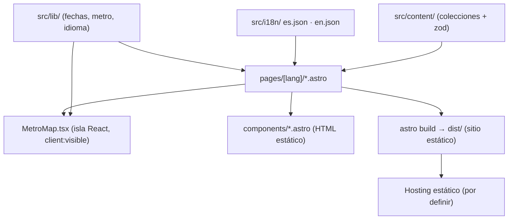

# Portafolio v1 — Design Spec

**Date:** 2026-09-22
**Status:** Approved

---

## Contexto

Portafolio web público de Juan Sebastián Martínez Noreña (Ingeniero de Sistemas y Computación, UPTC 2026) para mostrar experiencia y conocimientos de forma más visual e interactiva que el CV.

- **Audiencia principal:** reclutadores y equipos de RRHH de empresas (normalmente **no técnicos**). Audiencia secundaria pequeña: posibles clientes de proyectos.
- **Restricciones de lectura:** los reclutadores dedican ~7 s a la primera pasada, leen en patrón F (arriba y borde izquierdo) y el 80% de ese tiempo va a: nombre, cargo, empresa, fechas y educación. Muchos revisan desde el celular.
- **Fuente de verdad del contenido:** la hoja de vida ATS (`Hoja_de_vida_Juan_Sebastian_Martinez_ATS.pdf`), más el proyecto de la Hackathon Boyacá Innovate 2025 y los cursos.
- **Documentación:** sigue la estructura de los proyectos de `Proyectos Gobernacion/` (ver sección *Documentación*), no la de `ProyectoPersonal`.

---

## Objetivos

1. Un enlace que un reclutador no técnico entienda en 30 s: quién es, qué hace, qué logró, cómo contactarlo, CV descargable.
2. Visualmente original pero profesional: paleta morado oscuro + lavanda y un **mapa de recorrido tipo metro** para la experiencia.
3. Bilingüe español / inglés.
4. Rápido en celular, bien posicionado en buscadores y con buena vista previa al compartir en LinkedIn/WhatsApp.
5. Contenido separado de la presentación, para poder agregar un backend después sin reescribir la UI.

## No objetivos (v1)

- Backend, formulario de contacto con servidor, panel de administración, analítica, blog.
- Terminal interactiva, easter eggs u otras interacciones "para ingenieros".
- Elegir el proveedor de despliegue (se decide al final; ver *Despliegue*).
- Mostrar código, enlaces o datos reales de los sistemas de la Gobernación.

---

## Decisiones tomadas en el brainstorming

| Tema | Decisión |
|---|---|
| Audiencia | Reclutadores/RRHH (foco), clientes (secundario) |
| Estilo de interacción | Amigable y simple; sin easter eggs |
| Pantalla principal | Tarjeta de perfil fija a la izquierda + secciones a la derecha |
| Experiencia | Página propia con **metro vertical** (líneas de colores, lectura reciente → antiguo) |
| Paleta | Morado + lavanda (monocromática); modo oscuro basado en la variante "nocturno" |
| Idiomas | ES (por defecto) + EN, rutas `/es/` y `/en/` |
| Backend | Ninguno en v1 |
| Tecnología | Astro + isla React para el metro + Tailwind |
| Repositorio | Repo git propio en `Portfolio/` |
| Proyectos Gobernación | Nombre, descripción y resultados, capturas anonimizadas; sin enlaces ni código. `PostulacionesDocentes`: se puede mostrar su pantalla de inicio pública |
| Línea lavanda del metro | Proyectos propios y hackatón (no hay experiencia freelance) |

---

## Páginas

Todas existen en `/es/…` y `/en/…`. La raíz `/` redirige según `navigator.language` (por defecto `es`).

### 1. Principal — `/[lang]/`

**Tarjeta de perfil** (fija a la izquierda en escritorio; arriba en móvil):
- Foto, nombre completo, título: *Ingeniero de Software · Full-Stack, DevOps e Infraestructura*.
- Insignia *Disponible de inmediato · remoto, híbrido o presencial* (controlada por el campo `available`).
- Ubicación, formación (UPTC, 2026), idiomas (Español nativo, Inglés B2).
- Botón primario **Descargar CV** (PDF del idioma activo) y secundario **Contactar** (`mailto:`).
- Enlaces a LinkedIn y GitHub.
- Selector ES | EN y botón de tema claro/oscuro.

**Secciones a la derecha**, en este orden:
1. **Sobre mí** — 2–3 líneas en lenguaje no técnico.
2. **Experiencia** — cargo más reciente, 3 logros cuantificados y botón **Ver recorrido →** (lleva a `/[lang]/experiencia`).
3. **Proyectos destacados** — 3 a 5 tarjetas (captura, título, problema en una línea, un resultado). Clic → página de detalle.
4. **Habilidades** — grupos en lenguaje de persona, cada uno con sus tecnologías:
   - *Construyo aplicaciones* (TypeScript, Java, Next.js, NestJS, Angular, React, Node.js, Prisma)
   - *Las pongo en producción* (Docker, Docker Compose, Nginx, GitHub Actions)
   - *Mantengo servidores estables y seguros* (Nutanix AHV, AlmaLinux, Windows Server, Zabbix, Uptime Kuma, Keycloak, hardening)
   - *Gestiono datos* (PostgreSQL, Oracle SQL, MySQL, SQLite, MongoDB)
   - *Documento y lidero equipos* (docs-as-code, ADRs, coordinación de practicantes)
   - *Nube* (Azure, Google Cloud)
5. **Educación y cursos** — título universitario y cursos (nombre, institución, horas).
6. **¿Tienes un proyecto?** — bloque pequeño para clientes, con botón de contacto.

### 2. Recorrido — `/[lang]/experiencia`

- Encabezado con "← Volver al perfil" y, arriba del metro, la estación "¿Siguiente estación? — Hablemos" (contacto).
- **Metro vertical** con tres líneas:
  - **Morado `#4c1d95` — Empleo:** Tech Lead (ago 2025 – ago 2026), Practicante (mar 2025 – jul 2025).
  - **Lavanda `#a78bfa` — Proyectos propios y hackatón:** Hackathon Boyacá Innovate 2025 / Cárdenas Visión (oct 2025 – hoy), AzureDistribuidos, Ancla, otros.
  - **Gris — Estudios y cursos:** Ingeniería de Sistemas UPTC (graduado 2026), cursos.
- Orden: de lo más reciente a lo más antiguo. Las líneas se ramifican y convergen según las fechas.
- Cada estación es un botón que expande su tarjeta: título/cargo, organización, fechas, logros, tecnologías y enlaces a proyectos relacionados. Solo una abierta a la vez; la más reciente está abierta al cargar.
- Leyenda de colores visible.
- Móvil: misma estructura vertical, más estrecha; **nunca** desplazamiento horizontal.

### 3. Detalle de proyecto — `/[lang]/proyectos/[slug]`

Caso de estudio: **Problema** (qué pasaba antes) · **Mi rol** · **Solución** · **Resultado** (con cifras) · **Capturas** · **Tecnologías** · enlaces (repo/demo) **solo** si `visibility = "full"`.

### 4. 404 — bilingüe, con enlace a la principal.

---

## Arquitectura

### Repositorio

Repo git propio en `Portfolio/`. Estructura:

```
Portfolio/
├── README.md
├── CLAUDE.md
├── .gitignore                 ← incluye .superpowers/, node_modules, dist
├── .github/workflows/ci.yml
├── frontend/                  ← único paquete en v1 (pnpm, sin workspaces)
│   ├── package.json
│   ├── astro.config.mjs       ← i18n es/en, @astrojs/react, Tailwind, sitemap
│   ├── public/
│   │   ├── cv/                ← CV-Juan-Sebastian-Martinez-ES.pdf / -EN.pdf
│   │   └── img/               ← foto, capturas anonimizadas, imagen OG
│   └── src/
│       ├── content/           ← colecciones (datos)
│       ├── content.config.ts  ← esquemas zod de las colecciones
│       ├── i18n/              ← es.json, en.json (textos de interfaz) + helpers
│       ├── lib/               ← lógica pura testeable (fechas, metro, idioma)
│       ├── layouts/BaseLayout.astro
│       ├── components/        ← ProfileCard, Section, ProjectCard, SkillGroup, CourseList, LangSwitch, ThemeToggle
│       ├── components/metro/  ← MetroMap.tsx (isla React)
│       ├── pages/
│       │   ├── index.astro    ← redirección por idioma
│       │   ├── 404.astro
│       │   └── [lang]/{index,experiencia}.astro, proyectos/[slug].astro
│       └── styles/tokens.css  ← variables de color claro/oscuro
└── docs/
```

Si en el futuro hay backend, vive en `Portfolio/backend/` junto a `frontend/`, como en los proyectos de Gobernación.

### Principios

- **Contenido ≠ presentación.** Ningún texto de contenido va escrito directamente en los componentes; todo sale de `src/content/` o de `src/i18n/`.
- **HTML estático por defecto.** El único JavaScript del cliente es: la isla `MetroMap` (`client:visible`), el cambio de tema y el selector de idioma (scripts pequeños sin framework).
- **Mejora progresiva del metro.** El HTML generado en el servidor ya contiene todas las estaciones y sus detalles; sin JS se ven como lista expandida.
- **Lógica pura en `src/lib/`** (sin dependencias de Astro), para probarla con Vitest.



---

## Modelo de contenido

Todo texto visible es `{ es: string, en: string }` (tipo `Localized`). El esquema zod exige ambos idiomas: si falta una traducción, el build falla.

| Colección | Tipo | Campos |
|---|---|---|
| `profile` | entrada única | `name`, `title: Localized`, `summary: Localized`, `location: Localized`, `available: boolean`, `availabilityNote: Localized`, `email`, `phone?`, `linkedin`, `github`, `cv: { es, en }` (rutas), `languages: { name: Localized, level: Localized }[]`, `photo` |
| `experience` | lista | `line: "work" \| "projects" \| "education"`, `organization: Localized`, `role: Localized`, `start` (YYYY-MM), `end` (YYYY-MM \| null = hoy), `location?: Localized`, `highlights: Localized[]`, `tech: string[]`, `projects: slug[]` |
| `projects` | lista | `slug`, `title: Localized`, `tagline: Localized`, `problem`, `role`, `solution`, `result: Localized`, `metrics?: Localized[]`, `images: { src, alt: Localized }[]`, `tech: string[]`, `visibility: "full" \| "anonymized"`, `repo?`, `demo?`, `featured: boolean`, `order: number` |
| `skills` | lista | `group: Localized`, `tech: string[]`, `order` |
| `courses` | lista | `name: Localized`, `institution`, `hours?`, `year?`, `certificateUrl?`, `order` |

**Regla de visibilidad:** si `visibility = "anonymized"`, el esquema **rechaza** `repo` y `demo` (refinamiento zod), para que ningún proyecto institucional publique enlaces por error.

### Contenido inicial (de la hoja de vida)

- **Experiencia (empleo):** Ingeniero de Software e Infraestructura (Tech Lead), Gobernación de Boyacá — Dirección de Sistemas, 2025-08 → 2026-08. Practicante de Desarrollo de Software, misma dirección, 2025-03 → 2025-07.
- **Logros destacados a mostrar en la principal:** −57% de infraestructura (7 → 3 VMs); 7 aplicaciones en producción usadas por cientos de funcionarios; monitoreo y alertas centralizados (Zabbix + Uptime Kuma); despliegue continuo automatizado (GitHub Actions).
- **Proyectos:** Gobernación (anonimizados; `PostulacionesDocentes` con su pantalla de inicio pública), Hackathon Boyacá Innovate 2025 → aplicación para **Cárdenas Visión** (rol: líder de equipo; entregada a la empresa, sigue en desarrollo en conjunto), AzureDistribuidos (`visibility: full`, repo público), Ancla (`visibility: full`, repo público).
- **Cursos:** Programación en Java — Boomlabs Computer Science (200 h); Diplomado de Java — Politécnico de Colombia (120 h); Google Cloud — GCP Foundations Academy (40 h, 4 cursos); Hackathon Boyacá Innovate 2025 — Reto Empresarial Cárdenas Visión (30 h, 28–30 oct 2025).

Las fases 1–5 usan este contenido inicial y marcadores de imagen; la fase 6 incorpora foto, capturas anonimizadas, CV en PDF y la redacción final ES/EN.

---

## Idiomas (i18n)

- i18n nativo de Astro: `locales: ["es", "en"]`, `defaultLocale: "es"`, `prefixDefaultLocale: true`.
- `/` → script mínimo que redirige a `/en/` si `navigator.language` empieza por `en`; si no, a `/es/`. Incluye `<noscript>` con enlaces a ambos.
- El selector ES | EN lleva a la **misma ruta** en el otro idioma.
- `<html lang>`, `hreflang` alternos y `og:locale` por página.
- Fechas formateadas con `Intl.DateTimeFormat` según idioma ("ago 2025" / "Aug 2025"); duraciones ("1 año 1 mes" / "1 yr 1 mo") desde `src/lib/dates.ts`.

## Tema y estilo

- Tokens CSS en `styles/tokens.css` usados por Tailwind:
  - Claro: primario `#4c1d95`, secundario `#a78bfa`, superficie suave `#ede9fe`, fondo `#f7f5fc`, texto `#1e1433`, texto secundario `#6b6480`.
  - Oscuro: fondo `#150d24`, superficie `#231638`, primario `#a78bfa`, texto `#ede9fe`, texto secundario `#a79cc4`.
- Tema inicial = `prefers-color-scheme`; el botón lo cambia y se guarda en `localStorage` (con try/catch). Script en `<head>` para evitar el parpadeo.
- Tipografía sans-serif legible (una familia de Google Fonts con `font-display: swap`, a fijar en el plan).
- Animaciones suaves de entrada y del metro, desactivadas con `prefers-reduced-motion`.

## Accesibilidad

- Contraste WCAG AA en todo el texto, en ambos temas.
- Metro: cada estación es `<button aria-expanded aria-controls>`; recorrible con Tab / Enter / Espacio; foco visible.
- `alt` bilingüe obligatorio en todas las imágenes (lo exige el esquema).
- Estructura semántica: un `h1` por página, landmarks (`header`, `main`, `nav`, `footer`).

## SEO y vista previa al compartir

- Por página: `title`, `meta description`, Open Graph (`og:title`, `og:description`, `og:image`, `og:locale`) y Twitter card.
- `@astrojs/sitemap` y `robots.txt`.
- Imagen OG estática por idioma en `public/img/`.
- JSON-LD `Person` en la página principal.

---

## Manejo de errores

Es un sitio estático, así que los errores se atrapan en **build**, no en ejecución:

- Contenido inválido, traducción faltante, proyecto anonimizado con enlaces o slug referenciado inexistente → el build falla con el mensaje de zod.
- Ruta inexistente → `404.astro`.
- Sin JavaScript → el sitio es navegable; el metro se muestra como lista expandida; la raíz muestra enlaces a `/es/` y `/en/`.
- `localStorage` no disponible → el tema sigue la preferencia del sistema.

---

## Pruebas y calidad

- **Vitest** (lógica pura en `src/lib/`): formato de fechas y duraciones ES/EN, orden y agrupación de estaciones del metro por línea y fecha, cálculo de ramificaciones de líneas, detección de idioma inicial, refinamientos del esquema (anonimizado sin enlaces, `Localized` completo).
- **Playwright** (smoke): `/es/` y `/en/` cargan; el selector de idioma conserva la ruta; los enlaces de CV responden 200; el metro abre una estación con teclado; en viewport 375 px no hay scroll horizontal; la raíz redirige.
- **`astro check`** y **build** completos.
- **CI (GitHub Actions)** en cada push y PR: instalar → `astro check` → Vitest → build → Playwright → Lighthouse CI con meta ≥ 90 en rendimiento, accesibilidad, buenas prácticas y SEO.

---

## Documentación (estructura Gobernación)

```
README.md
CLAUDE.md
docs/
├── index.md
├── log.md
├── 01-arquitectura/
│   ├── architecture.md
│   ├── decisions/
│   │   ├── 0001-astro-sitio-estatico.md
│   │   ├── 0002-sin-backend-v1.md
│   │   ├── 0003-i18n-rutas-es-en.md
│   │   └── 0004-metro-vertical-isla-react.md
│   └── diagrams/
├── 02-desarrollo/
│   ├── setup-local.md
│   ├── variables-entorno.md
│   ├── convenciones.md
│   └── como-editar-contenido.md
├── 03-operacion/
│   ├── deploy.md
│   └── troubleshooting.md
├── 04-onboarding/onboarding.md
└── superpowers/{specs,plans}/
```

Cada archivo de `docs/` (excepto specs y plans) lleva frontmatter `type` / `tags` y cierra con `Última actualización: YYYY-MM-DD`. Los ADRs siguen el formato `Estado / Contexto / Decisión / Consecuencias`.

---

## Despliegue

Proveedor **por decidir** al terminar la fase 5. `03-operacion/deploy.md` compara Vercel, Netlify, Cloudflare Pages y GitHub Pages (todos gratuitos para sitios estáticos) y el uso de un dominio propio. La salida de `astro build` (`frontend/dist/`) debe funcionar en cualquiera de ellos sin cambios de código; solo cambia la variable `SITE_URL`.

---

## Fases de implementación

Cada fase termina con build verde y su propio commit.

1. **Base:** repo, scaffold Astro en `frontend/`, Tailwind, tokens y tema, i18n, `BaseLayout`, colecciones y esquemas, CI, docs iniciales (README, CLAUDE.md, `docs/` completo con ADRs).
2. **Página principal:** tarjeta de perfil, secciones, habilidades, educación y cursos, bloque de proyectos.
3. **Metro:** lógica en `src/lib/metro.ts` + `MetroMap.tsx` + página `/experiencia`.
4. **Detalle de proyecto** y 404.
5. **SEO y pulido:** OG, sitemap, JSON-LD, Lighthouse ≥ 90, animaciones, revisión de accesibilidad.
6. **Contenido real:** foto, capturas anonimizadas, CV ES/EN en PDF, redacción final de logros.
7. **Despliegue:** elegir proveedor, publicar, actualizar `deploy.md` y `log.md`.

## Pendiente de entrega (usuario)

Foto de perfil; capturas anonimizadas de los proyectos de Gobernación y la pantalla de inicio pública de `PostulacionesDocentes`; material del proyecto Cárdenas Visión (capturas y qué se puede mostrar); CV en PDF en español e inglés; cursos adicionales si los hay.
